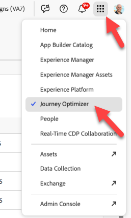
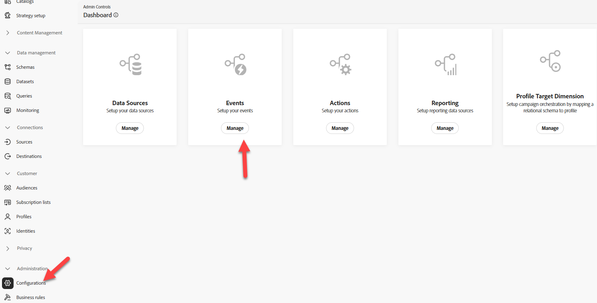
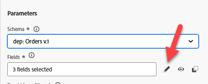
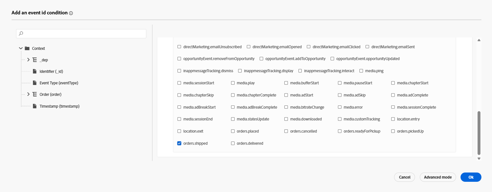
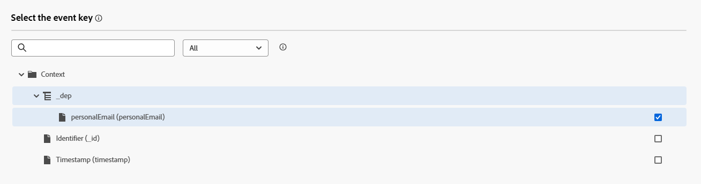

# イベントの設定

## 学習目標

購入後のアクション（発送済み）が発生したときにカスタマージャーニーをトリガーするイベントを作成および設定します。

## Journey Optimizerに移動します

ブラウザーの右上隅にある&#x200B;**Cube**&#x200B;をクリックし、**Journey Optimizer**&#x200B;を選択します

## 注文発送イベントの設定

単一イベントを使用するジャーニーを作成するには、まずイベントを設定する必要があります。

1. 管理メニューの左側のパネルで「**設定**」をクリックし、「イベント」タイルで「**管理**」ボタンをクリックします

のイベントタイルの「管理」ボタン

2. 右上の「**イベントを作成**」ボタンをクリックします

3. イベントの設定を次のように更新します。
   - **名前** = `orderShipped`
   - **種類** = `Unitary`
   - **イベント ID タイプ** = `Rule based`
   - **スキーマ** = `dep: Orders v.1`

4. `Fields`入力ボックスで、**鉛筆アイコン**&#x200B;をクリックします

フィールド入力ボックスの

5. 次のフィールドを選択してイベントに追加し、完了したら&#x200B;**OK** ボタンをクリックします
   - `Event Type (eventType)`
   - `Order ID (orderID)`

>[!NOTE]
>
>注文ID フィールドのみを選択し、注文😁のすべてのフィールドを選択しないでください

6. `Event Id condition input`で、**鉛筆アイコン**&#x200B;をクリックします

イベント ID条件入力](assets/configure-event-click-event-id-condition-pencil.png)の

8. 表示される選択ボックスで、**orders.shipped.**&#x200B;というタイトルの値を探して確認します 次に、**OK** ボタンをクリックします。

選択ボックスで

9. 次に、名前空間とプロファイル識別子の最後の2つの値を、次に示す値で更新します。
   - **名前空間** —> `Email`
   - **プロファイル識別子** —> `personalEmail`

に設定されています

>[!NOTE]
>
>**使用される名前空間とプロファイル IDは何ですか？**
>
>イベントを使用するジャーニーでは、そのイベントに対して、プロファイルの検索に使用するID名前空間と関連プロファイル識別子を指定する必要があります。 ひとつ以上のIDを選択すると、ジャーニーの動作に影響を与える可能性があることを理解することが重要です。
>
>*簡単な例：*
>
>イベントペイロードは、ECID （プライマリ ID）と顧客ID （オプション）のようなIDを含むページビューです
>
>- ECIDが選択されました – > ID サービスがこの関係を見るのは初めてである可能性が高いため、ジャーニーがこのイベントを受信すると、ECIDを使用してプロファイルを検索し、プロファイルを見つけることができなくなります。  なぜでしょうか？ ECIDと顧客IDの間に関係がまだ存在せず、プロファイルの特性は既知の識別子Customer IDに対して保存される可能性があります
>- 選択した顧客ID —>このIDは入力する必要がなく、ほとんどのページビューでは空になる可能性があります。  したがって、このIDが選択された場合、ジャーニーIDが設定されている認証済みページビューがあるときにのみ、顧客が起動します。
>
>簡単な答え：正解はありません。ユースケース 😃に基づいて行う必要があるトレードオフだけです

## Final orderShipped イベント設定

最後のイベント設定が以下と一致することを確認します。  問題ないようです。**保存** ボタンをクリックします

>[!TIP]
>
>最初のAJO イベントが設定されました。 自分で5位！

## まとめ

ジャーニーのエントリポイントとして使用できる、Adobe Journey Optimizerで設定された注文出荷イベント
