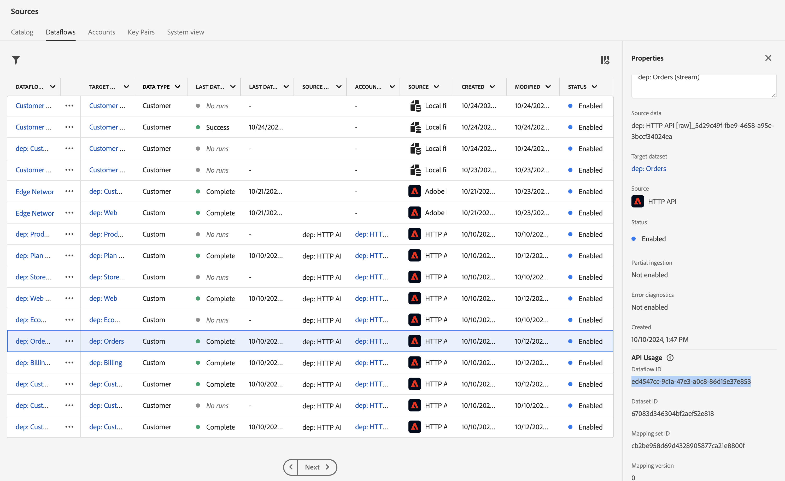
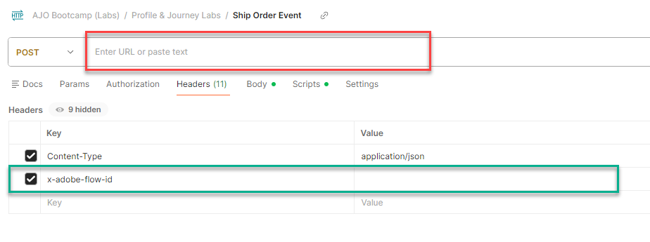

# イベントの送信

## 学習目標

Postmanを使用して、注文の配送済みイベントをシミュレートし、ジャーニーをトリガーします

## HubへのストリーミングとEdgeの比較

以前、Edgeにイベントを送りました。  イベントでストリーミングするバックエンドシステムがありますが、Edgeに送信する必要がない場合があります。  このラボでは、注文出荷イベントを&#x200B;**ストリーミングしてHub**&#x200B;に送信する方法を示します（別名、サーバー間のサーバー、例：注文が出荷されたことを示すAEPへのCommerce Server）。

## 検証イベントがプロファイルにありません

1. **プロファイル**&#x200B;に移動し、プロファイルを検索します。
   - **ID名前空間** -> `email`
   - **ID値** -> `henry.creel@emailsim.io`
1. 「**イベント**」タブをクリックします。
   - **no** `orders.shipped`件のイベントが必要です

## API リクエストを変更

API リクエストを作成するには、API リクエストの本文に次の部分を入力する必要があります。

まず、次の値を収集します。

### アカウントストリーミングエンドポイントの検索

1. 左側のパネルの&#x200B;**ソース**&#x200B;に移動し、上部のナビゲーションの&#x200B;**アカウント**&#x200B;をクリックします
1. **dep: HTTP API \[raw]**&#x200B;を検索し、行を強調表示して、**ストリーミングエンドポイント**&#x200B;の値を後で参照できる場所にコピーして保存します

![dep: HTTP API [raw] アカウント行がストリーミングエンドポイント値](assets/send-an-event-streaming-endpoint-account-row.png "dep: HTTP API \[raw]")で強調表示される

### データフローIDの検索

1. **dep: HTTP API \[raw]**&#x200B;をクリックします
1. **dep：注文（ストリーム）**&#x200B;のレコードを検索するには、データフローリンクをクリックします
1. 右側のパネルのコピーで、**データフローID**&#x200B;値を後で参照できる場所に保存します

&#x200B;> [!WARNING]
>
>行の空のスペースをクリックします。  青いリンクをクリックしないでください。

右側のパネルに表示される

### Postmanを開く

コンピューターでPostmanを起動し、次のAPI呼び出しに移動します。

- **Postman左サイドバー** —> `Collections`
- **コレクション** —> `AJO Bootcamp (Labs)`
- **フォルダー** —> `Profile & Journey Labs`
- **API リクエスト** —> `Ship Order Event`

### 最終的なAPI リクエストの作成

1. 前の手順で保存した値を、以下に強調表示されている場所にコピーします。
1. 「**Headers**」をクリックし、これらの値を貼り付けます（末尾のスペースを削除します）。
   - **赤** —> `Streaming Endpoint URL`
   - **緑** —> `Dataflow ID`
     - 値はGUIDのように見えます（httpで始まりません）

&#x200B;> [!CAUTION]
>
>まだ実行しないでください。

## APIの実行

1. **保存** ボタンをクリックして、API呼び出しを保存します
1. **送信** ボタンをクリックして、リクエストを実行します

呼び出しが成功すると、次の応答が返されます…

## まとめ

船舶注文イベントがプラットフォームに正常に送信されました
