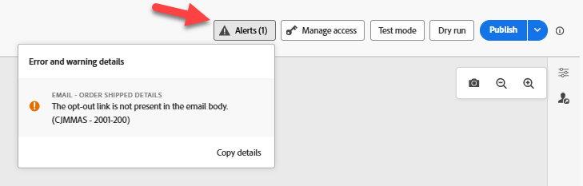
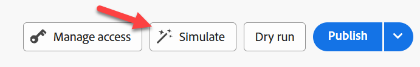
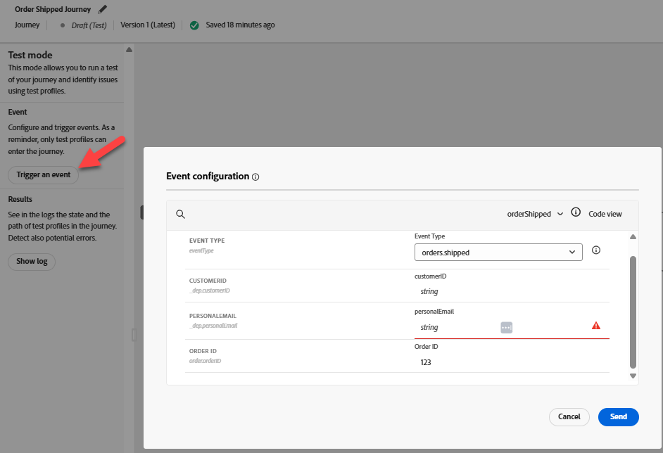
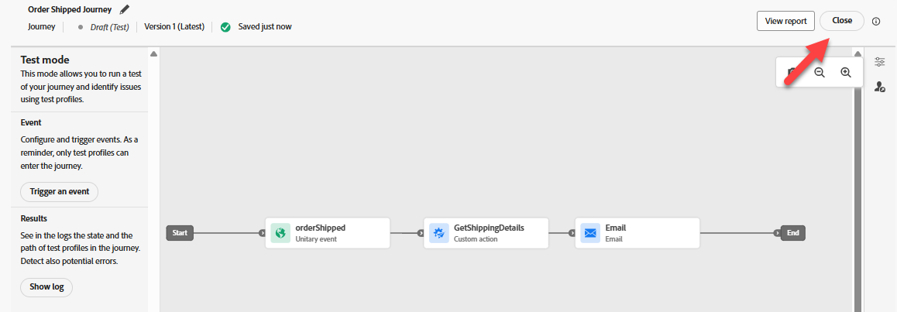

# ジャーニーのテスト

## 学習目標

ジャーニーテストツールを使用して、イベントトリガーとジャーニーロジックが正しく設定されていることを確認します。

## ジャーニーのテスト

1. 左側のパネルの&#x200B;**ジャーニー**&#x200B;をクリックし、ジャーニーのリストが表示されない場合は&#x200B;**参照タブ**&#x200B;をクリックします
2. **ジャーニー**&#x200B;をクリックして開きます
3. **アラート**&#x200B;をクリックして、エラーがないことを確認します（警告は問題ありません）

   ジャーニーを開いた後にエラーが表示されない

   >[!NOTE]
   >
   >**CJMMASとは – 2001-200**
   >
   >メールのバリエーションにオプトアウトリンクがないことを示します

4. **Simulate**&#x200B;をクリックし、左側の&#x200B;**テストモード**&#x200B;を選択します

   左側の「シミュレート」で


   >[!NOTE]
   >
   >準備に1分はかかるかもしれません。 その間、トリガーボタンは使用できません。


5. 「**イベントをトリガー**」をクリックし、次のプロパティを入力します。
   - **イベントタイプ**: `orders.shipped`
   - **個人用メール**: `henry.creel@emailsim.io`
   - **注文ID**: `123`
6. 「**送信**」をクリックします（送信をクリックした後、応答に数秒かかります）

   

   >[!WARNING]
   >
   >一部の学生はエラーを受け、これを数回送信する必要があります。 この&#x200B;**複数**&#x200B;回実行する必要がある場合があります。
   >
   >**最初の送信で次のエラーが発生することがあります**:
   >
   >**インレットが存在しません（参照ID: 3216a850-c40d-11f0-8fa5-73d1522cc9a2）**
   >
   >エラーが発生した場合は、「**イベントをトリガー**」をクリックしてから、もう一度&#x200B;**send**」をクリックします。  これを&#x200B;**複数回**&#x200B;実行する必要がある場合があります。


7. **Results** ->左側の&#x200B;**Show Log**&#x200B;をクリックします


>[!NOTE]
>
>エラーを受け取った学生の中には、空のインスタンス配列`{"instances": []}`を示す異なるログを受け取ることがあります。 これはブロッカーではありません。次のステップに進んでください。

ログに次のような内容が表示されます。

>[!NOTE]
>
>使用されるキーフィールドを探しています：**actionsHistory**、**transitionsHistory**、**eta**、**tracking_number**、**eventType**、**personalEmail**、および&#x200B;**orderID**。

```json
{
  "actionsHistory": {
    "8919055f-1b00-4a43-8bd6-c8af894474b2": {
      "eta": "11/27/2025",
      "tracking_number": "091204404",
      "jo_status_code": "http_200"
    }
  },
  "transitionsHistory": {
    "orderShipped (1158856989)": {
      "eventType": "orders.shipped",
      "_id": "joTestModeEvent_5abbfdcd-561d-45a7-ba42-d0640539831a",
      "_dep": {
        "personalEmail": "henry.creel@emailsim.io"
      },
      "order": {
        "orderID": "123"
      },
      "timestamp": "2025-11-17T23:30:49.576289372Z"
    }
  }
}
```


1. ブラウザー&#x200B;**タブ**&#x200B;を&#x200B;**閉じる**
1. 右上の&#x200B;**テストモードを閉じる**

   

1. 右上のジャーニー「**公開**」をクリックします

   右上のジャーニーの「

1. 左上の\&lt; – 矢印をクリックして、**ジャーニー**&#x200B;を&#x200B;**閉じる**


次に、実際の注文出荷イベントをAEPに送信します

## まとめ

ジャーニーは設定検証に合格し、イベントを受信する準備ができました
