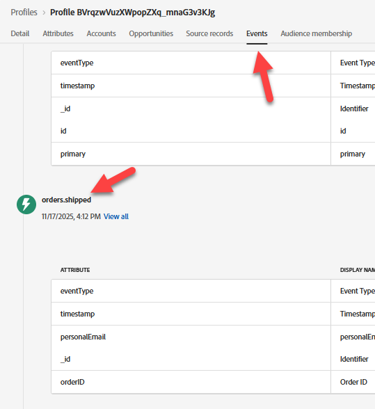
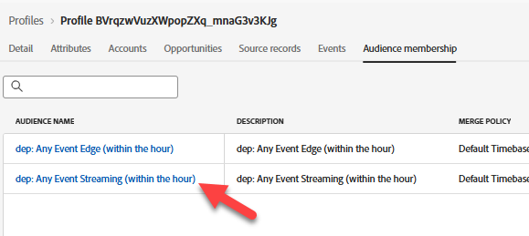

# 取り込まれたイベントを検証

## 学習目標

イベントがAdobe Experience Platformに正常に取り込まれたことを確認します。

## プロファイル内のイベントの検証

1. **プロファイル**&#x200B;に移動し、プロファイルを参照して、イベントがプロファイルに取り込まれていることを確認します。  数秒で表示されます。
   - **ID名前空間** -> `email`
   - **ID値** -> `henry.creel@emailsim.io`
2. 「**イベント**」タブをクリックします。 `orders.shipped` イベントを探します。

プロファイルの「イベント」タブに表示される

>[!WARNING]
>
>**message.feedback** イベントが発生しました。  これらはジャーニーによるもので、通常は失敗または除外を示します。  それらをクリックし、`reason`を確認します。
>
>本番環境では、次のような例に遭遇する可能性があります。
>
>- EmailNoAddressFoundInProfile （電子メールを持っていないプロファイルに電子メールを送信しようとしました）
>- EmailNoConsent （同意が「いいえ」に設定されているプロファイルに電子メールを送信しようとしました。

3. プロファイルが&#x200B;**オーディエンス**&#x200B;に適格であることを検証します（数分かかる場合があります）。
   - Any Event Edge（15分以内）
   - 任意のイベントストリーミング（15分以内）

## 自分のメールを試す

プロファイルが取り込まれたことを検証したら、お客様自身の電子メールを使用して、注文の発送イベントを送信します。

1. Postmanに戻り、**出荷注文イベント**&#x200B;を見つけます
2. **Body**&#x200B;をクリックし、**電子メールアドレス**&#x200B;を自分のものに変更します。

3. **保存**&#x200B;して、**送信**&#x200B;をクリックします。
4. 手順1～3に戻り、電子メールアドレスを使用して検証します。

## まとめ

イベントはプロファイルストアに表示され、プロファイルはイベントを探していたオーディエンスの一部になりました。
