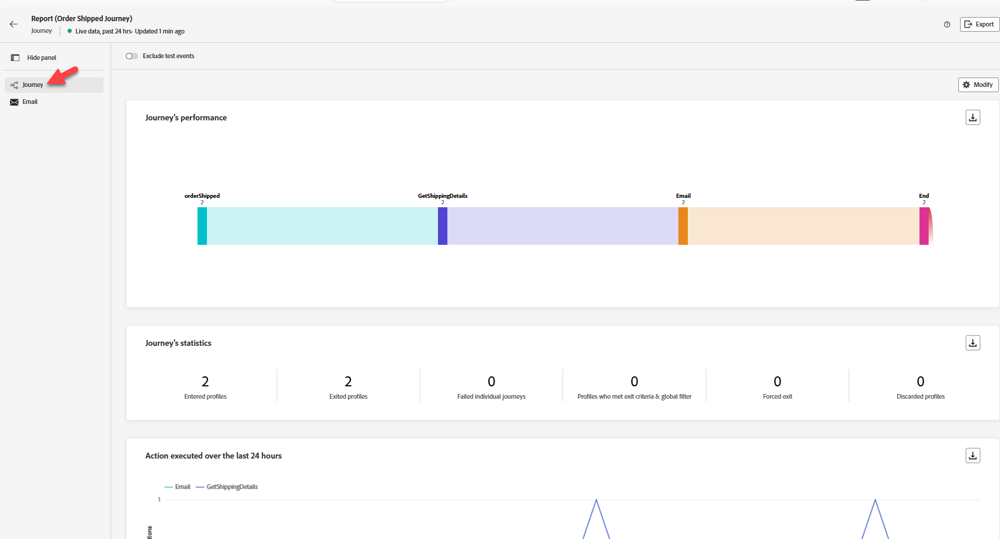
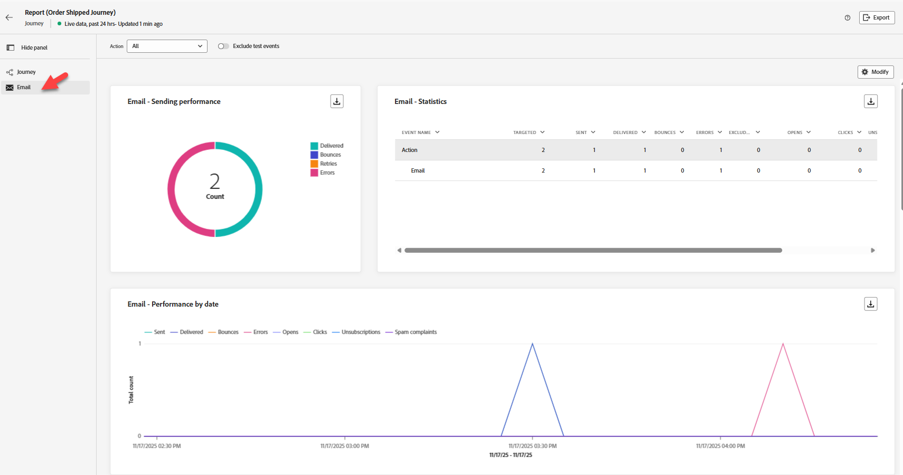

# ジャーニーを検証

## 学習目標

ジャーニーがトリガーされ、期待どおりに実行されたことを確認します。  レポートに、期待どおりに更新された指標が表示されていることを確認します。

## ジャーニーを確認する

1. 「Order Shipped」ジャーニーに移動し、閉じた場合は開きます
2. 少なくとも2つのプロファイルが入力されています

   

3. 右上の「**レポートを表示** -> **過去24時間**」をクリックします。
4. デフォルトでは、**ジャーニー** タブ（左側のパネル）に表示されます
   - エントリと離脱が表示されます（カウントは、送信したイベント数、テスト、エラーなどによって異なります）。



すべてがきれいに処理された場合（下にスクロールして確認します）:

**ジャーニーの統計情報**

3つの入力されたプロファイル（Henry、You、そして私たちが行ったテスト）

必要に応じて、上部の切り替えスイッチをクリックして、**テストイベントを除外**&#x200B;し、これらの数値が変化します

3 Exited Profiles （Henry, You and the Testing we did） シングル

**実行されたアクションとエラー**

6つのアクション（3つの電子メール、3つのGetShippingDetails）

**アクションエラーの理由**

0 エラー（できれば）

**イベント**

3つのイベント（注文済み）

3外部イベント

1. **電子メール** タブ（左側のパネル）をクリックします
   - **電子メール – パフォーマンスの送信**
     - **配信済み**&#x200B;および&#x200B;**送信済み**&#x200B;の値が表示されます（カウントは、送信したイベント数やエラーなどによって異なります）。
     - エラーがないことを願います（以前に問題が発生した場合を除く）
   - **電子メール – 統計**
     - 電子メール - 3件のターゲティング、送信、配信

   送信パフォーマンスと統計を表示する

1. **電子メールの受信トレイ**&#x200B;を確認し、電子メールが届いているかどうかを確認します（以下のようになります）
   - *,*&#x200B;ご注文からETAが発送されました：*10/17/2026* トラッキング番号：*051009364*

   >[!NOTE]
   >
   >AJO キャンペーン [ajo-campaigns@email.dep-labs.com](mailto:ajo-campaigns@email.dep-labs.com)の迷惑メールフォルダーを確認してください

   >[!NOTE]
   >
   >**名が見つからないのはなぜですか？**
   >
   >電子メールアドレスのイベントコンテキストを確認するように、「電子メール」ノードを変更しました。  しかし、パーソナライゼーションのファーストネームは\{\{profile.person.name.firstName\}\}から取得しています。
   >
   >メールアドレスのプロファイルを検索する際、firstNameをお持ちですか？


1. *30 ～ 60分後*、次のデータレイクでデータセットを確認することもできます。**クエリ** -> **クエリを作成** -> **SQLをコピー/ペースト** -> **実行**

>[!NOTE]
>
>出荷された注文イベントはストリーミング配信されたため、プロファイルはすばやく更新されましたが、データレイクが更新されるまでにしばらく時間がかかります。

```sql
SELECT * FROM dep_orders
WHERE timestamp >= CURRENT_DATE
LIMIT 10
```

dep_orders データセット の クエリサービス結果

## ボーナス（ステップイベントを確認）

>[!NOTE]
>
>ステップイベントは、プロファイルがジャーニーを開始するたびに、ジャーニーのあらゆるステップを記録します。 注：これらのイベントをデータセットに記録するのに数分かかる場合があります。


1. クエリサービスでは、このSQLを実行することで、ステップイベントデータセットが取得しているものを表示できます。 以下のSQLをコピーし、クエリに貼り付けます。

```sql
select timestamp,
  identityMap,
  _experience.journeyOrchestration.stepevents.journeyVersionName,
  _experience.journeyOrchestration.stepevents.NodeName,
  _experience.journeyOrchestration.stepevents.*
  from journey_step_events
limit 50
```

結果には100以上の列があり、ステップイベントのレコードのアイデアを提供します。

>[!NOTE]
>
>各フィールドの意味について詳しくは、AJO スキーマ ディクショナリを参照し、ジャーニーステップイベントスキーマ [https://experienceleague.adobe.com/tools/ajo-schemas/schema-dictionary.html?lang=ja](https://experienceleague.adobe.com/tools/ajo-schemas/schema-dictionary.html?lang=ja)にドロップダウンを変更してください。


## まとめ

ジャーニーインスタンスがジャーニーレポートまたはログに表示され、設定されたアクションが実行されます
