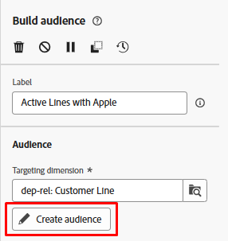
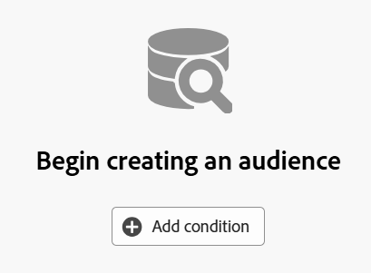
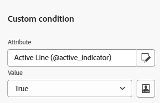
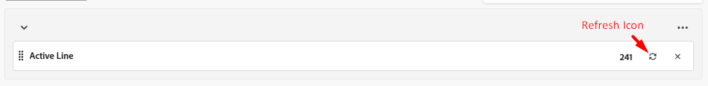
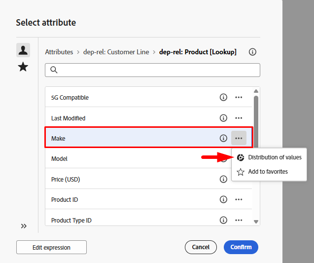
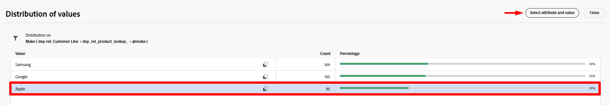
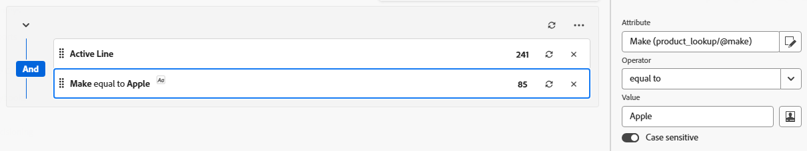
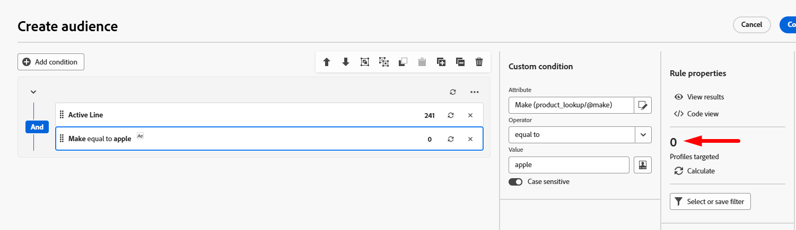

# オーディエンスの構築

## 目標

次の手順では、キャンペーンのターゲットとなるオーディエンスを作成します。これは、起動中のフラッグシップ電話と一致するメーカーを持つすべてのアクティブなラインホルダーです。  この目標は、SMS メッセージでターゲットにするグループで、携帯電話をアップグレードするように促します。

## 「オーディエンスを作成」アクティビティを追加

1. キャンバスで&#x200B;**+記号**&#x200B;をクリックし、**オーディエンスを作成** アクティビティを選択してワークフローに追加します

を追加

&#x200B;2. 右側のパネルには、オーディエンスを作成プロパティがあります。 ラベルを更新して、次の状態を示します：`Active Lines with Apple`

## ターゲティングディメンションを選択

次の手順は、**ターゲティングディメンション** （つまり、クエリするテーブル）を選択することです。 次の手順を実行します。

1. ターゲティングディメンションボックスの&#x200B;**検索アイコン**&#x200B;をクリックします

&#x200B;2. ポップアップで、**dep-rel: Customer Line**&#x200B;という名前のテーブルを検索して選択し、**確認** ボタンをクリックします。

>[!NOTE]
>
>作成する各オーディエンスの&#x200B;**ターゲティングディメンション**&#x200B;を常に覚えておいてください。 その重要性は次のステップで説明します。

>[!NOTE]
>
>Adobeで作成されたスキーマを選択したことがある場合、スキーマは – > *（caas）*&#x200B;で始まることに注意してください。 これは、リレーショナルストア内のテーブルに適用される名前空間であり、Campaign as a Serviceを表します。）

## オーディエンスを作成

ターゲティングディメンション（クエリするリレーショナルスキーマ）を選択したら、定義の作成を開始できます。

1. 右側のパネルで「**オーディエンスを作成**」ボタンをクリックします

&#x200B;2. 次に、**条件を追加** ボタンをクリックします

## 条件を作成

次に、スキーマにある属性を使用してオーディエンスのロジックを記述します。 ここでの目的は、Adobe Appleを使用して、アクティブなすべてのカスタマーラインを検索することです。

### 条件#1を作成

1. 次の情報を使用して条件を設定します。
   - **属性**: `Active Line`
   - **値**: `true`

に等しいアクティブな行に設定されました

&#x200B;2. 条件の適格カウントを表示するには、**更新** アイコンをクリックします。

条件1に対する241の適格カウントを示す更新アイコン

>[!TIP]
>
>条件を正しく構築すると、241の結果が表示されます

### 条件#2を作成

1. **条件を追加** ボタンをクリックし、**>** アイコンをクリックして&#x200B;**dep-rel:** **製品\[Lookup]** スキーマを選択します

![詳細：製品[検索] スキーマを選択するには、> アイコン &#x200B;](assets/build-an-audience-select-product-lookup-schema.png)をクリックします

&#x200B;2. **Make**&#x200B;という名前のフィールドを探し、3つのドットをクリックして、**値の分布**&#x200B;を選択します

&#x200B;3. 様々な値に注意してください。 `Apple`だけが必要です。幸いなことに、スペルが100も異なりません。 **Apple フィールド**&#x200B;をクリックして選択し、右上の&#x200B;**属性と値を選択ボタン**&#x200B;をクリックします。

>[!NOTE]
>
>これは、データアーキテクトが列挙を使用してスキーマを設計すべき場所の代表例です。  これにより、マーケターは、値を手動で選択したり入力したりする必要がなくなります。  データアーキテクトは恥だ！

&#x200B;4. `Make` フィールドは、以下に示す条件と共に自動的に追加されます。
   - **演算子：** `Equal to`
   - **値：** `Apple`
   - **大文字と小文字を区別：** `Enabled`

&#x200B;5. **計算アイコン**&#x200B;をクリックすると、結果は85になります。

）

>[!NOTE]
>
>グループ内でのAND演算子の使用に注意してください。 ANDは、オーケストレーションされたキャンペーンに対して、両方の条件を満たす必要があることを示しているので、これを示すグループのように単一グループで作成するか、複数のグループで作成するかは重要です。

## カウントを確認

1. ターゲットプロファイルの見出しの下の右側のパネルにある&#x200B;**計算アイコン**&#x200B;をクリックすると、オーディエンスサイズの正確な見積もりを取得できます。 **65**&#x200B;が&#x200B;**最終回数**&#x200B;として表示されます。

であることを示す計算アイコン

>[!NOTE]
>
>個々の条件が異なる数値（条件#1 —> 241および条件#2 —> 85）を返したが、最終的なオーディエンスサイズは2つの条件のうち小さいものでした。  これはAND演算子のおかげです。

&#x200B;2. **65**&#x200B;の最終的なカウントが表示された場合は、画面の右上にある&#x200B;**確認** ボタンをクリックし、右上の&#x200B;**保存** ボタンをクリックして作業を保存します。

## 課題

`Make`が`apple`と等しい（小文字）最後の条件で入力し、`Case sensitive`の設定オプションを終了したあと、`on`が切り替わったとします。  これにより、条件レコードのカウントが0に等しくなります。  つまり、241のアクティブな行と0のメイクがappleになります。

**この場合、最終的なオーディエンスサイズは何ですか？**

## 回答

ゼロです。 なぜかご存知ですか？

## まとめ

最初のオーディエンスが正常に作成され、オーディエンスを作成アクティビティ内でカウントを簡単に作成および検証できるようになりました。

