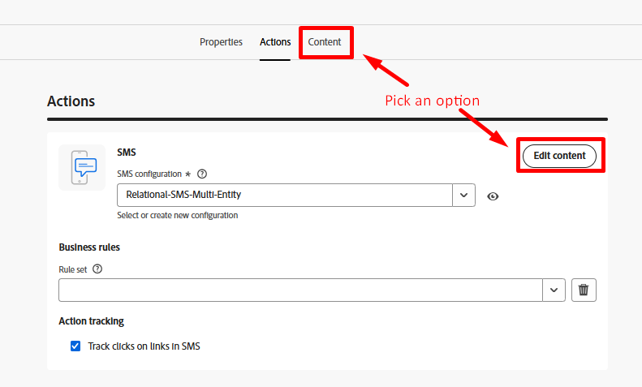
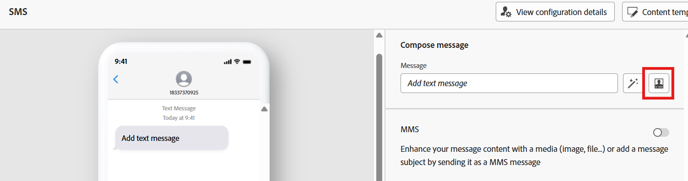
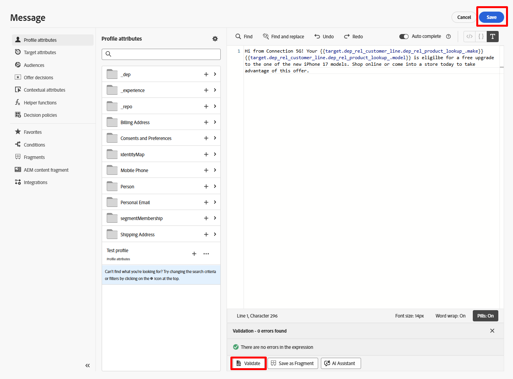

# SMSの作成

## 目標

次の手順では、非常にシンプルなSMS メッセージを作成します。  非常に基本的なレベルでコンテンツを簡単に追加し、リレーショナルストアのデータにもとづいてメッセージをパーソナライズする方法をご確認ください。


## コンテンツに移動

「**コンテンツを編集**」ボタンをクリックするか、**コンテンツ** タブに直接移動します




## メッセージの作成

1. 「**Personalization**」ボタンをクリックして、メッセージを作成します。

   

   >[!NOTE]
   >
   >「魔法の杖」オプションは、AIを使用してメッセージを書くのに役立ちます。 ご覧になりたいのですが、このラボでは取り上げません。


2. 以下のテキストをSMS メッセージ本文にコピーして貼り付けます。

   ```none
   Hi from Connection 5G! Your phone_make phone_model is eligible for a free upgrade to one of the new iPhone 17 models. Shop online or come into a store today to take advantage of this offer.
   ```

   >[!NOTE]
   >
   >メッセージエディターでWordの回り込みを&#x200B;**On**&#x200B;に切り替えてください。  ウィンドウの右下のペインに表示されます。


3. 左側のパネルの「**ターゲット属性**」オプションを使用して、下の「**phone\_make**」と「**phone\_model**」というメッセージの2つのフィールドを更新します。  完了したら、メッセージはスクリーンショットと一致する必要があります。

   

   >[!NOTE]
   >
   >訪ねてきましたが？  この情報は、リレーショナルストアのCustomer Line テーブル内に格納されます。  この例では、オーケストレーションされたキャンペーンのデータを使用してメッセージをパーソナライズする方法を示します。


4. エディターで&#x200B;**Validate**&#x200B;をクリックし、検証エラーがないことを確認し、**Save** ボタンをクリックします

   


5. ワークフローキャンバスに戻るには、**戻る矢印（\&lt; – ）**&#x200B;をクリックします


## まとめ

メッセージを作成したばかりで、メッセージエディターの仕組みについてもう少し詳しくなったと思います。  リレーショナルストアのデータを使用してパーソナライズできますが、リアルタイム顧客プロファイルのデータを使用してパーソナライズすることもできます。

>[!NOTE]
>
>リアルタイム顧客プロファイル属性を使用して、オーケストレーションされたキャンペーンのメッセージをパーソナライズする場合は、データレイクのプロファイルスナップショットデータセットから引き出されていることを覚えておいてください。これにより、属性が最大24時間前に作成されます。 プロファイルスナップショットは、毎日のバッチセグメント化ジョブの後に1日1回だけ更新されます。
