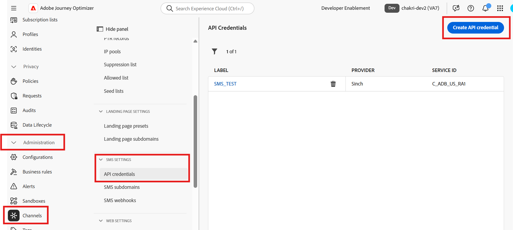
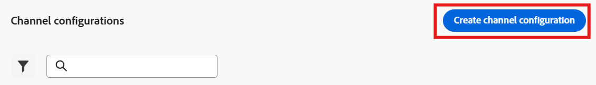
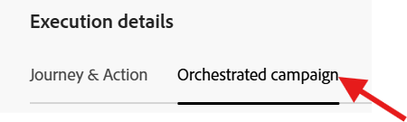
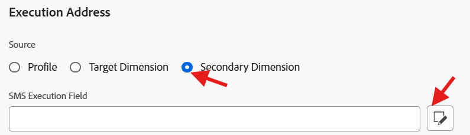
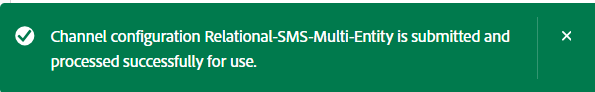
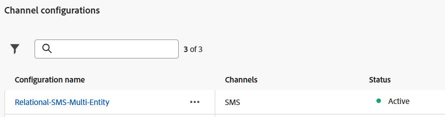

# SMS チャネルの設定

## 目標

次の一連の手順では、SMS チャネルを設定します。 これは、施策を構築する際に、後で個々のラインホルダーにメッセージを送信するために必要です。

## チャネルへの移動

1. Adobe Journey Optimizerで、**管理** -> **チャネル** メニューに移動します。
1. **SMS設定** → **API資格情報**&#x200B;を選択します。
1. 「**API資格情報を作成**」をクリックします。

## SMS API資格情報の定義

まず、AJOがアウトバウンド SMS リクエストの送信に使用するAPI コネクタを作成します。

1. 「SMS ベンダー」で「**Twilio**」を選択します。
1. 独自の[Twilio体験版アカウント ](https://www.twilio.com/try-twilio)を使用して、次のAPI資格情報の詳細を入力します。
   - **名前：** `DEP SMS`
   - **アカウント SID:**&#x200B;がTwilio Console ダッシュボードに見つかりました
   - **認証トークン：**&#x200B;がTwilio Console ダッシュボードに見つかりました（**表示**&#x200B;をクリックすると表示されます）
1. **送信**&#x200B;をクリックして、API資格情報を登録します

>[!NOTE]
>
>この手順を開始する前に、確認済みの電話番号を持つ無料のTwilio体験版アカウントが必要です。 [twilio.com/try-twilio](https://www.twilio.com/try-twilio)にサインアップし、Twilio Console ダッシュボードでアカウント SIDと認証トークンを見つけます。

Twilio ベンダー](assets/configure-sms-channel-enter-api-credentials.png)のでチャネル設定に移動します

2. 「**チャネル設定を作成**」をクリックします。

   

3. SMS チャネル設定設定を次の値で入力します。
   - **名前：** `Relational-SMS-Multi-Entity`
   - **チャネル：** `Mobile Message`
   - **マーケティングアクション：** `SMS Targeting`

>[!NOTE]
>
>ユーザーに権限がないことを示すエラーが発生した場合は、無視して続行します。

## SMS設定

「チャネル」を「モバイルメッセージ」として選択すると、「SMS設定」という新しいセクションが表示されます。 次の詳細を入力します。

- **モバイルメッセージの種類：** `Marketing`
- **モバイルメッセージ設定：** `DEP SMS`
- **送信者番号：** `01234567890`
- **サブドメイン：** `leave blank`
- **オプトアウト番号：** `leave blank`

送信者番号とモバイルメッセージタイプを含む

## 実行の詳細

1. 「実行の詳細」で、「**オーケストレーションされたキャンペーン**」タブをクリックします

   の下の「キャンペーンを調整」タブ

2. 「**有効**」チェックボックスがオンになっていることを確認します

   

3. 次に、**実行ディメンション**&#x200B;のサブセクションの下で、次のように設定されていることを確認します。
   - **次のメッセージを配信：** `Target + Secondary Dimension`
   - **Profile Target Dimension:** `dep-rel: Customer Account - customer_id`
   - **Dimension:** `Customer Line`

   

   で顧客行に設定されています

   >[!NOTE]
   >
   >これは、メッセージを送信する際に、Profile Target Dimensionに一致するメッセージをレコードごとに1つ配信する必要があることをOrchestrated Campaignsに伝えています。

4. 「実行アドレス」見出しで、**Dimension**&#x200B;のラジオボタンを選択し、**SMS実行フィールド**&#x200B;の「編集」ボタンをクリックします

   

5. ポップアップで、スキーマ **dep-rel: Customer Line**&#x200B;をクリックし、**Mobile Phone**&#x200B;を選択します。

   営業担当者の

   dep-relから

6. 最後の「実行の詳細」セクションが次のように一致することを確認します

## 送信してレビュー

1. **送信** ボタンをクリックして設定を完了すると、成功メッセージが表示されます

   チャネル設定を送信した後の

2. チャネル設定インベントリ ページで、次に進む前にステータスが&#x200B;**アクティブ**&#x200B;として表示されていることを確認します

   

   >[!CAUTION]
   >
   >ステータスが&#x200B;**Active**&#x200B;になるまで待ちます。そうしないと、将来のラボステップが失敗します

3. ステータスが「アクティブ」になると、完了です。

>[!TIP]
>
>🚀 ブーヤ！ SMS チャネルがライブになり、アクションの準備が整いました。

## まとめ

これで、SMS チャネルを正常に設定する方法を確認しました。  これはAPI ベースのSMSであるため、プロバイダーによっては、認証に別の方法を使用する場合があります。

ご興味のある方は、[こちら](https://experienceleague.adobe.com/en/docs/journey-optimizer/using/channels/sms/configure-sms/sms-configuration)をご覧ください。
