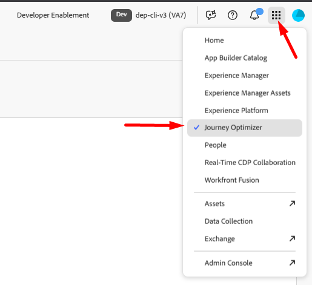
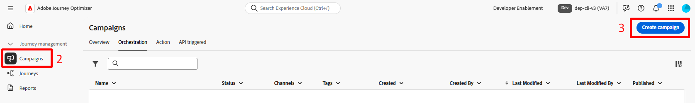
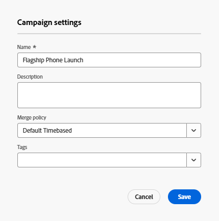
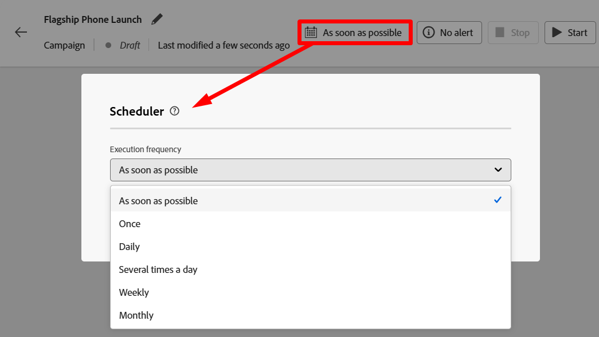

# オーケストレーションされたキャンペーンの作成

## 目標

次の一連の手順では、任意のキャンペーンの開始点となるオーケストレーションキャンペーン（アクティビティなし）のシェルを作成します。

## キャンペーンに移動

1. まず、ブラウザーの右上にあるアプリドロワーからアプリケーションを選択して、Adobe Journey Optimizer アプリケーションにログインしていることを確認します

   

2. 左側のナビゲーションパネルで、**キャンペーン**&#x200B;を選択します
3. 次に、右上の「**キャンペーンを作成**」ボタンをクリックします

   

4. 表示されるモーダルで、**Orchestration - Marketing**&#x200B;を選択し、**Confirm**&#x200B;をクリックします

## キャンペーン設定

1. 必要なキャンペーンメタデータに次の情報を入力します。
   - **名前** —> `Flagship Phone Launch`
   - **説明** —> *空のままにする*
   - **結合ポリシー** —> `Default Timebased`
   - **タグ** —> *空のままにする*

   完了すると、画面は以下のようになります。

   

2. 「**保存**」ボタンをクリックして続行します。

## スケジュールについて

キャンペーンを作成した後、すぐにワークフローキャンバスに移動する必要があります。  右上には、このワークフローをキャンペーンに実行する頻度を示すスケジュール設定オプションがあります。

デフォルトは常に&#x200B;**できるだけ早く**&#x200B;に設定されます。 この演習では、既定値を使用しますが、他にも多くのオプションを利用できます。

キャンペーンワークフローが「スケジューラーオプション」を実行する頻度の

## まとめ

これで、オーケストレーションされたキャンペーンの作成方法と、スケジューリングに関して使用可能な一般的なオプションを確認しました。
