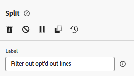
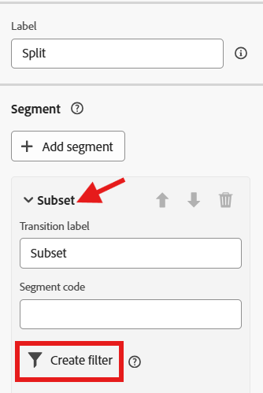
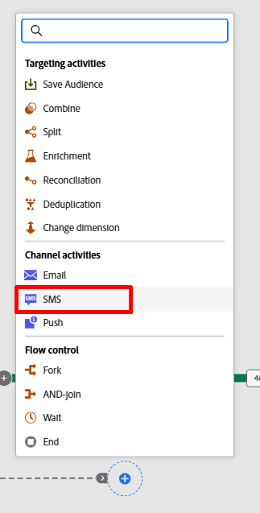
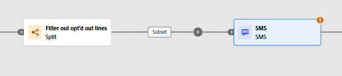
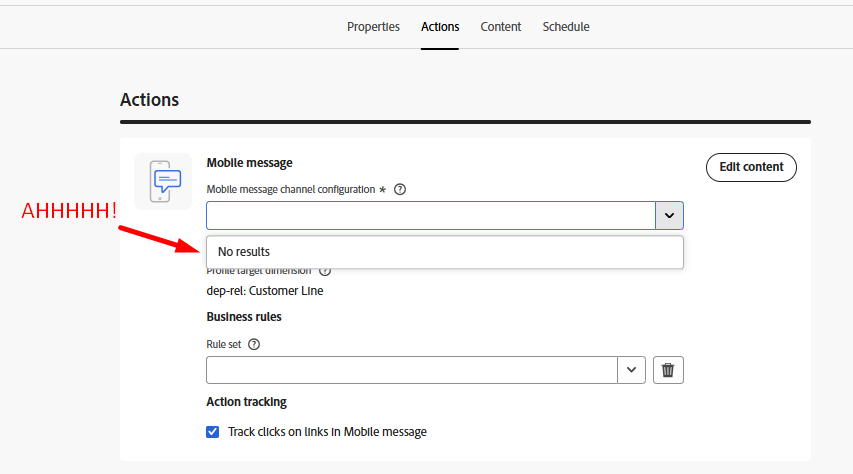
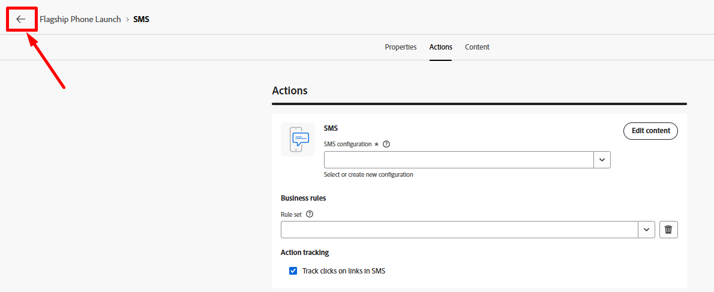
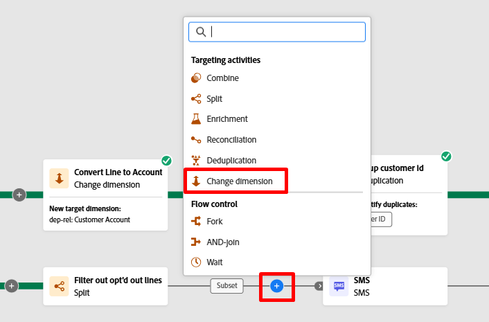
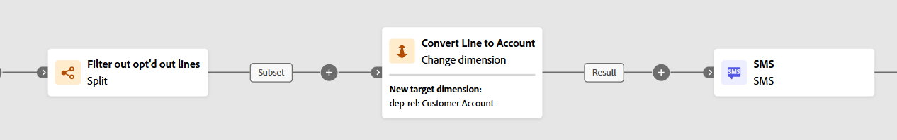
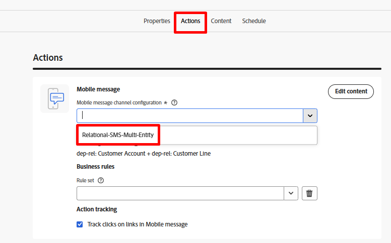

# 行をフィルタリング

## 目標

次の一連の手順では、行レベルでオプトアウトしているため、SMS メッセージで実際にターゲットにできない行をすべて除外します。  これが行レベルのターゲットであるため、プロファイルの同意に依存することはできません。

## 分割アクティビティの設定

1. フォークアクティビティの下部のトランジションにある&#x200B;**+** アイコンをクリックし、ポップアップで「**分割**」アクティビティを選択します。

   

2. 右側のパネルでラベルを更新し、次の内容を示します：`Filter out opt'd out lines`

   

3. 右側のパネルで、「**サブセット**」セクションを展開し、「**フィルターを作成**」ボタンをクリックします

   

4. SMS メッセージからオプトアウトされるすべての顧客行を削除する条件を追加し、**確認**&#x200B;をクリックします。

   

   >[!NOTE]
   >
   >条件の作成方法を理解する必要がありますが、最終的な結果は上記のスクリーンショットと一致します。  分かったぞ！

5. 右上の「保存」ボタンをクリックして、作品を保存します。  あなたのキャンバスは今このように見えます\...

## SMS アクティビティの追加

1. ワークフローキャンバスで、追加した分割条件の後にある&#x200B;**+** アイコンをクリックし、**SMS アクティビティ**&#x200B;を選択します

   

   

2. 右側のパネルで「SMSを編集」ボタンをクリックして、SMS メッセージの設定を開始します

   

3. 上部のナビゲーションで「アクション」メニュー項目をクリックし、SMS設定ドロップダウンから、以前に作成したチャネルを選択します。

>[!CAUTION]
>
>申し訳ありません🫨!  なぜ結果が出ないのか？  SMS チャネルを設定していませんか？  製品が壊れていますか？
>
>興奮して！!!!!!!!!

## フリークアウトモーメント

フォークの移行には、現在、顧客行のターゲティングディメンション（つまり、現在の結果がリレーショナルストアでどのテーブルに関連しているか）があります。  オーケストレーションされたキャンペーンでユニークなのは、メッセージからの配信とトラッキング情報がプロファイルに関連付けられるように、送信時に常にリアルタイム顧客プロファイルに戻ることです。  この結合は、顧客アカウントテーブルから事前に構築されたものです。

SMSのチャネル設定は既に事前に設定されており、現在はこのように見えます…

**この読み方は次のとおりです：**

- セカンダリディメンション（顧客明細）で見つかった関連レコードの数に関するメッセージを、ターゲットディメンション（顧客アカウント）ごとに1つ配信します
- セカンダリディメンション（顧客行）にある携帯電話番号を使用して、各SMS配信を実行します

複数のメッセージをひとつのプロファイルに送信できるこのユニークな機能は、ジャーニーとは一線を画すオーケストレーションキャンペーンの主な機能のひとつです。

それをどのように機能させるかを考えます？  変更ディメンション 😀を追加

## 変更ディメンションを追加

1. SMS編集画面の「戻る」ボタンをクリックします

   

2. ワークフローキャンバスで、フィルターとSMS アクティビティの間にある&#x200B;**+** **アイコン**&#x200B;をクリックし、**ディメンションの変更**&#x200B;を選択します。

   

3. 右側で、次の情報を使用して変更ディメンションを更新します。
   - **ラベル：** `Convert Line to Account`
   - **新しいターゲットディメンション：**`dep-rel: Customer Account`

   

4. キャンバスの右上にある「**保存**」ボタンをクリックして、作品を保存します。 完了すると、ワークフローは次のようになります。

## SMS メッセージ設定

ワークフローを修正したら、SMSを再設定します。

1. ワークフローキャンバスのSMS アクティビティをクリックし、左側のパネルで「**SMSを編集**」ボタンをクリックします

   

   >[!NOTE]
   >
   >この画面の読み込みに時間がかかります。  迷惑だと思いますし、修正だと信じています

2. 上部のナビゲーションで&#x200B;**アクション** メニュー項目をクリックし、SMS設定ドロップダウンから、以前に作成したチャネルを選択します。

>[!TIP]
>
>😮‍💨は良い感じではありません

## まとめ

この経験を通して、2つの非常に重要なことを学ぶことができたと思います。

1. 最終的な結果のターゲティングディメンションは、使用するチャネル設定と一致する必要があります
1. ディメンジョンを変更アクティビティは、これを確実に行うためのベストフレンドになる可能性があります
