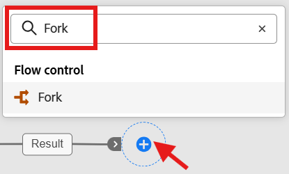
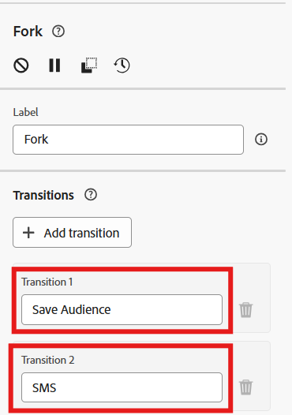

# 結果をフォーク

## 目標

この手順は簡単です。次の手順で、結果を複製して2つの異なることを行えるように、フォークアクティビティを追加するだけです。

1. オーディエンスを保存し、他のユーザーが広告やクロスチャネル目的で使用できるようにします
1. 各行にSMS メッセージを送信します。

## フォークを作成

1. ワークフローキャンバスで、「**+** **アイコン**」をクリックし、「**フォークアクティビティ**」を選択します

   

2. トランジションをクリックし、以下に示すように名前を割り当てることで、フォーク内の各トランジションの名前を更新します。
   - **上位** —> `Save Audience`
   - **Bottom** —> `SMS`

   

   キャンバスが完成したら、このように表示されます…

   

   >[!NOTE]
   >
   >基本的に、フォークのアクティビティは、前のアクティビティの結果を2つの独立したブランチに複製するだけです

3. ワークフローキャンバスの上部にある「**保存**」をクリックします。

>[!TIP]
>
>それはとても難しかったですね、😁

## まとめ

ウェルプ、結果の分岐を作成しました（つまり、結果を複製します）。これにより、分岐を明確に指示してオーディエンスを保存し、もう1つはSMS送信に使用できます。

>[!NOTE]
>
>オーディエンスを「オーディエンスを保存」アクティビティでアクティビティがフォローできないように保存する場合は、特にフォークを使用する必要があります。
