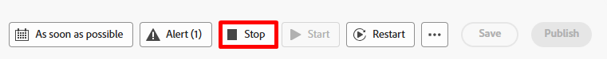
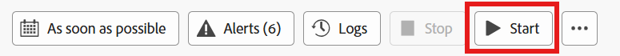
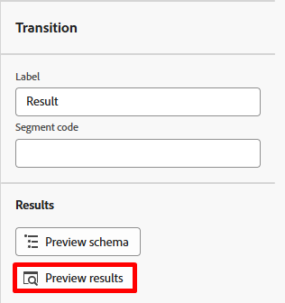
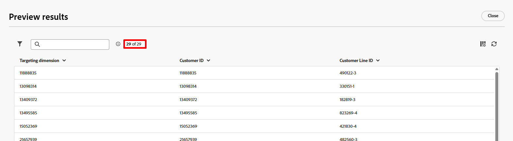
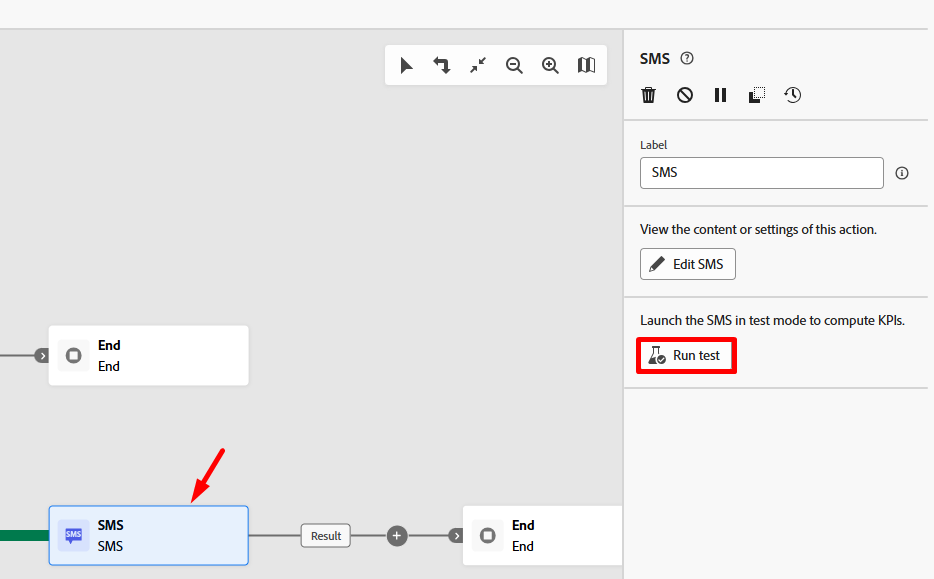
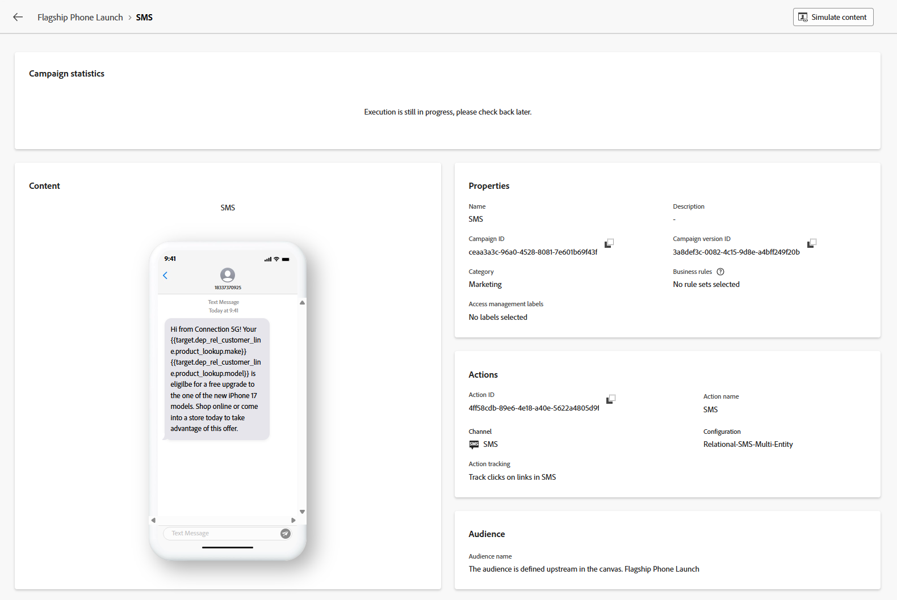
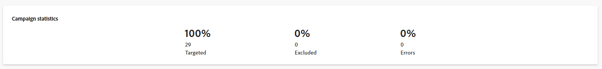

# ワークフローの実行

## 目標

次の手順では、ワークフローをテストする方法と、テストモードを使用してSMS アクティビティをより重要に説明します。

## ワークフローの検証

1. 完了すると、最終的なワークフローは次のようになります。 すべてが正常に表示されることを再確認します。 ご覧の通り：

   

2. ワークフローをまだ停止していない場合は、右上の「**停止**」ボタンをクリックします。

   ワークフローの右上にある

   >[!NOTE]
   >
   >オプションで「再起動」ボタンをクリックしてみますが、ワークフローの作成後にアクティビティが追加され、キャッシュが無効になったため、エラーが表示される可能性があります。

3. 次に、**開始** ボタンをクリックして、ワークフローをエンドツーエンドで実行およびテストします

   

4. **結果**&#x200B;をクリックし、SMS アクティビティに入ってくる結果を確認します（2つの結果があるので、下に示すように左側の結果を使用します）。次に、左側のレールで「**結果をプレビュー**」ボタンをクリックします。

   

   

5. **33 レコード**&#x200B;が表示され、ターゲティングディメンションが顧客ID （プロファイルへの結合キー）と一致します

顧客IDに一致するターゲティングディメンションを含む33 レコード

## SMS アクティビティのテスト

1. 前のウィンドウを閉じて、**SMS アクティビティ**&#x200B;をクリックし、右側のパネルの「**テストを実行**」ボタンをクリックします

   

2. ほとんどすぐに、**レポートを表示**&#x200B;というラベルの付いた新しいボタンが表示されます。  「**レポートを表示**」ボタンをクリックして、レポート画面に移動します。

   

   >[!NOTE]
   >
   >この画面は、テスト実行の実行に時間がかかるため、最初は表示されません。 結果が表示されるまでに、数回更新が必要な場合があります。

3. 結果が出ると、100%がターゲットになっていることがわかります。

   

   *しばらくお待ちください。受信した結果は33件のレコードで、4件のレコードはどこに移動しましたか？*

4. ワークフローキャンバスに戻り、SMS アクティビティに入ってくるトランジション **結果**&#x200B;をクリックし、右側のパネルの&#x200B;**結果をプレビュー**&#x200B;をクリックします。

   

5. 結果のプレビュー画面で、テーブルの一番下までスクロールすると、**4件のレコード**&#x200B;に&#x200B;**空白のターゲティングディメンション**&#x200B;があることがわかります。

テーブルの下部に空白のターゲティングディメンションを含む

## 説明

その結果、次のことが起こりました。

- SMS メッセージを送信したい顧客行が33件ありました
- これらの顧客明細の変更分析コード アクティビティ 4の後、関連付けられた顧客アカウントがありませんでした
- リアルタイム顧客プロファイルへの結合には顧客IDが必要です。この4つのレコードにはレコードがないので、プロファイルを検索したり、新しいプロファイルを作成したりすることはできません

結果 – > オーケストレーションされたキャンペーンは、メッセージ実行時にそれらの4つのレコードをドロップします

>[!NOTE]
>
>この問題に対処するために、次の2つの方法で機能強化が行われます。
>
>1. 送信時にターゲティングディメンションが欠落しているレコードの除外ログが作成されていることを確認します
>2. ディメンションの変更アクティビティを更新して、これらの4つのレコードを前面にドロップする内部結合と外部結合を行います

>[!SUCCESS]
>
>おめでとうございます。 これで、独自のオーケストレーションされたキャンペーンを開始し、責任を持って世界中にメッセージを放送することが正式に認定されました。 今では、自信を持ってマーケティングができます！

## ワークフローの公開

これはラボでは行われませんが、ここで説明するのは、公開時に何が起こるかです。

1. キャンペーンにスケジュールが設定されている場合、スケジューラーが
1. オーディエンスの保存アクティビティ オーディエンスポータル内でオーディエンスシェルを作成し、適格なプロファイルの取り込みを開始します
1. ワークフローの最初のメッセージアクティビティのメッセージ実行が開始されます
   - プロファイルの検索は、プロファイルスナップショットに対して行われます
     - 一致するプロファイルは、プロファイル上の同意を尊重します
     - 一致しないプロファイルはその場で作成されます
   - 配信ログは`AJO Message Feedback Event Dataset`に作成されます
