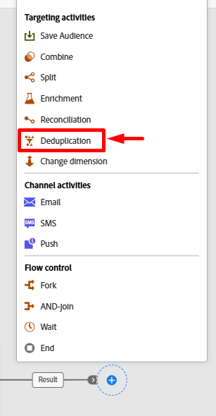
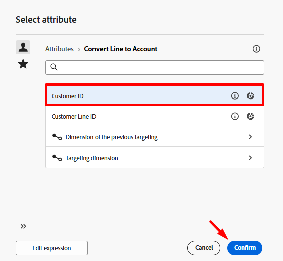
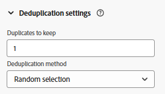
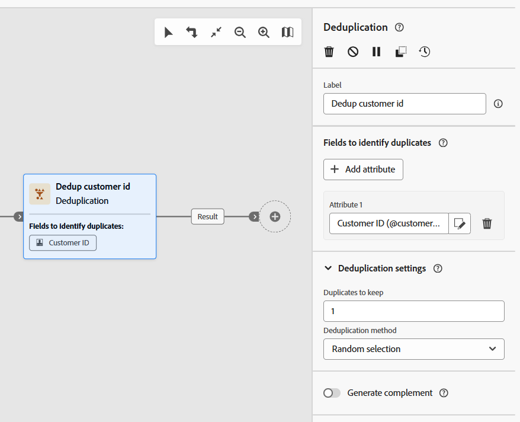
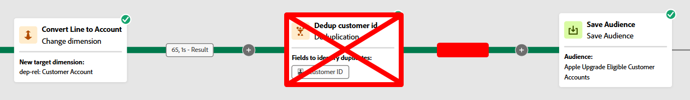

# オーディエンスを保存

## 目標

次の一連の手順では、作成したオーディエンスをオーディエンスポータルに保存し、Adobe Experience Platformとそのアプリケーションの他のソリューションで独自のユースケースに活用できるようにします。

## ディメンションの変更

1. ワークフローキャンバスで、**オーディエンスを保存** ブランチの&#x200B;**+** **アイコン**&#x200B;をクリックし、アクティビティのリストから「**ディメンションを変更**」アクティビティを選択します

   

2. 次の概要に従って、変更ディメンションのプロパティを更新します。
   - **ラベル：** `Convert Line to Account`
   - **新しいターゲットディメンション：** `dep-rel: Customer Account`

   

   

   >[!NOTE]
   >
   >**なぜこんなことをするのですか？**  リアルタイム顧客プロファイル（オーディエンスを保存する場所）に参加するには、dep-rel：顧客アカウントスキーマからのみ参加するように設定したプロファイルターゲットマッピングを使用する必要があります。

3. 完了すると、キャンバスはこのように表示されます。  あなたの作品を保存！

## 結果の重複排除

1. ディメンションの変更アクティビティの後に&#x200B;**+** **アイコン**&#x200B;をクリックし、アクティビティのリストから&#x200B;**重複排除** アクティビティを選択します

   

2. 重複排除アクティビティのラベルを`Dedup customer id`に更新します

   に設定されました

3. 次に、**+属性を追加** ボタンをクリックし、**顧客ID**&#x200B;というタイトルのスキーマからフィールドを選択します

   

   

4. 重複排除の設定で、次のセットが設定されていることを確認します。
   - **保持する重複：** `1`
   - **重複排除メソッド：** `Random selection`

   

   >[!NOTE]
   >
   >重複排除のその他のオプションでは、独自のカスタムロジックを指定できます。  重複排除が必要な場合は、ほとんどの場合、テーブルのプライマリキーを使用して実行します。

5. 完了すると、キャンバスはこのようになります。 次に進む前に、右上の「**保存**」ボタンをクリックします。

## 「オーディエンスを保存」アクティビティを追加

1. 重複排除アクティビティの後にある&#x200B;**+** アイコンをクリックし、**オーディエンスを保存** アクティビティを選択します

   

2. 右側のパネルで、アクティビティのプロパティを次のように設定します。
   - **オーディエンスラベル**: `Apple Upgrade Eligible Customer Accounts`
   - **プロファイルマッピングフィールド**: `dep-rel: Customer Account - customer id`

>[!NOTE]
>
>「プロファイルマッピングフィールド」は、リレーショナルストアがリアルタイム顧客プロファイルに結合できるように、以前に設定したものです。  プロファイルは顧客アカウントレベルとしてモデル化されているので、オーディエンスを同じレベルに保存します。  したがって、変更ディメンションと重複排除が必要になります。

## オーディエンスフィールドマッピング

デフォルトでは、ターゲティングディメンション（顧客ID）のプライマリキーがフィールドとしてオーディエンスに追加されます。 右側を見てフィールドを展開すると、これが表示されます。  注目すべき2つの点：

- **Source オーディエンスフィールド** —>は、リレーショナルスキーマからのフィールドを指します
- **ターゲットオーディエンスフィールド** —> オーディエンスの保存の一部として作成されるフィールドの名前

>[!NOTE]
>
>ターゲットオーディエンスフィールドに`Dep_rel_customer_account_Customer_id`という名前が付けられていることにひどく注意してください。  マーケターにわかりやすいものに変更する必要があります。

## デフォルトのオーディエンスフィールドを修正

1. 次に示すように、デフォルトのターゲットオーディエンスフィールドの名前を&#x200B;**Customer\_ID**&#x200B;に変更します。

   に変更されました

   >[!TIP]
   >
   >これで、人間が判読可能なフィールド名🎉ができました

2. 「**開始**」ボタンをクリックして、ワークフローを実行します。 ワークフローは次のようになり、カウントは次のようになります。
   - オーディエンスを作成：`65`
   - 行をアカウントに変換：`65`
   - 重複排除の顧客ID: `46`

>[!NOTE]
>
>オーディエンスを保存アクティビティは、ワークフローが公開されたときにのみオーディエンスを作成し、単純に開始されたときにはありません。 オーディエンスを作成すると、オーディエンスに追加したすべての属性が含まれ、セグメント化サービスジョブの次のスケジュールされた日次の実行時にリアルタイム顧客プロファイルに結合されます。

>[!CAUTION]
>
>ワークフローを公開しないでください。

## 課題

オーディエンスを保存する前に重複排除を行わない場合はどうなりますか？  オーディエンスは65のレコードをすべて保存するのか、46のレコードのみを保存するのか？

## 回答

オーディエンスは65件すべてのレコードを保存しますが、「オーディエンスを読み込む」アクティビティでは、結合条件😁に基づいて読み込み時にレコードが重複排除されます

## まとめ

これで、「オーディエンスを保存」の仕組みと、重複排除が重要な理由について理解できるようになります。  リレーショナルストアのデータは、リアルタイム顧客プロファイルへの結合方法を把握している必要があるため、プロファイルターゲットマッピングを常に定義する必要があることを忘れないでください。  プロファイル ターゲット マッピングは、結合条件🙂です
