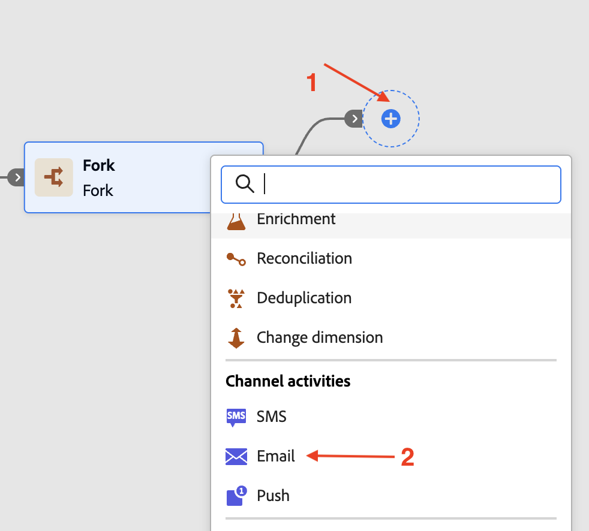
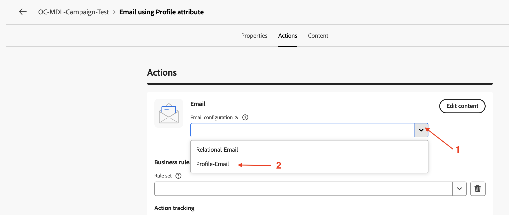
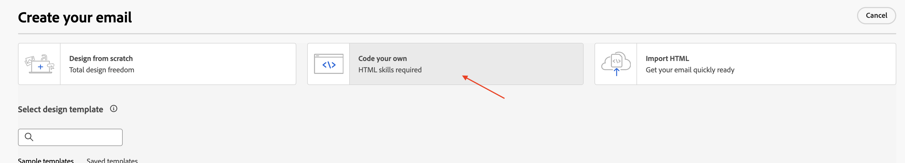
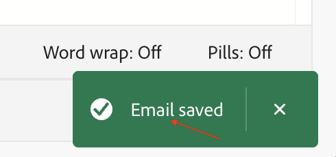
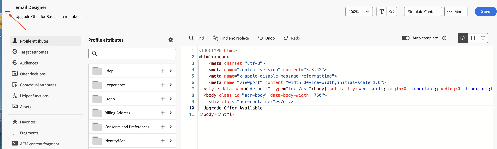
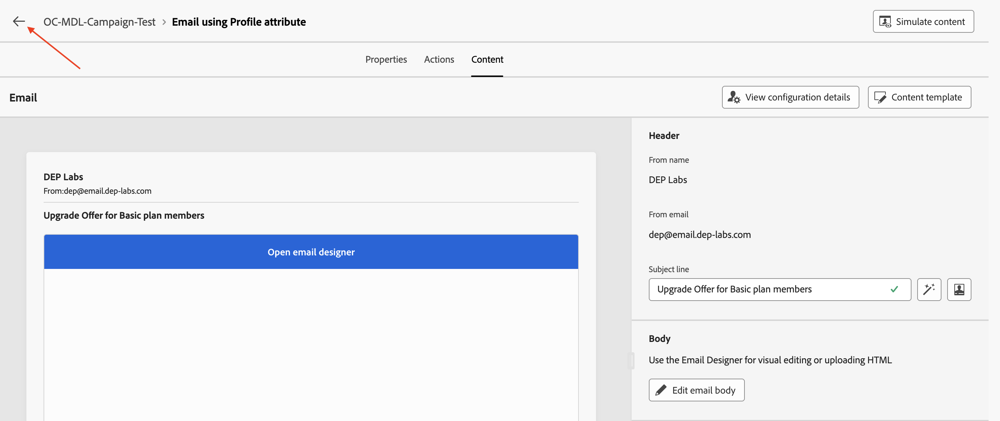

# メールアクティビティの追加

## 目標

次の一連の手順では、キャンペーンを構築して、2つのメールアクティビティを2つのフォークアクティビティブランチに追加します。 先ほど作成したメールチャネルを使用するように、2つのメールアクティビティを設定します。 最後に、これらの各メールアクティビティに基本的なメール設定（件名と本文）を追加します。

>[!CAUTION]
>
>続行する前に、両方のメールチャネル設定がステータスでアクティブであることを確認する必要があります。
>
>

## 最上位ブランチのメールアクティビティを追加

1. 上位フローの&#x200B;**+**&#x200B;をクリックし、**チャネルアクティビティ**&#x200B;から&#x200B;**電子メール**&#x200B;を選択します

   

   **電子メール**&#x200B;の詳細ペインが開きます

   

2. **Email** アクティビティのプロファイル属性&#x200B;**を使用してラベルの名前を** Emailに変更し、**メールを編集**&#x200B;をクリックします。 メール本文の作成は、テスト目的でのみ行われます

   

3. 「**アクション**」タブを選択し、ドロップダウンから「**プロファイル – メール**」チャネル設定を選択します

   

4. 次に、**コンテンツを編集**&#x200B;をクリックして、テストコンテンツを追加します

   

5. **件名** （「基本プランメンバー向けアップグレードオファー」）を入力し、**メール本文を編集** ボタンをクリックします

   

6. 多くのオプションがあります。このテストでは、**独自のコードを作成** HTML オプションを選択します

   

7. **電子メール Designer**&#x200B;に、テスト行「Upgrade Offer Available!」を挿入します。 表示されている`</body></html>` タグの直前に、**保存**&#x200B;をクリックします

   

8. 右下隅に確認メッセージが表示されるのを待ちます

   

9. **電子メール Designer**&#x200B;の横にある&#x200B;**左向き矢印**&#x200B;をクリックして終了します

   

10. 確認ダイアログがポップアップ表示され、**保存して閉じる** ボタンをクリックします

11. メール本文に追加されたテキストを含む、メールのプロパティとアクションを確認します。 **左向き矢印**&#x200B;をクリックして、キャンペーンキャンバスに戻ります

## 下部ブランチのメールアクティビティを追加

キャンペーンキャンバスに戻り、下部フローの&#x200B;**+**&#x200B;をクリックし、**チャネルアクティビティ**&#x200B;から&#x200B;**電子メール**&#x200B;を選択します。 以下を除き、上記と同じ手順（手順2～11）に従います。

- **電子メール** アクティビティのTarget Dimension **を使用して、ラベルを**&#x200B;電子メールに変更します
- メール設定で、**Relational-Email** メールチャネル設定を選択します

## まとめ

これで、メールチャネルでメールアクティビティを設定する方法を確認しました。 各アクティビティは、非常に基本的なメールの件名と本文で設定されました。 次にキャンペーン全体をテストします。
