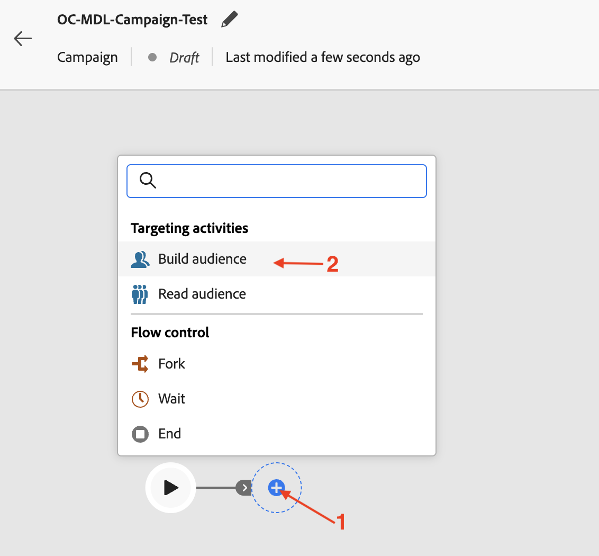
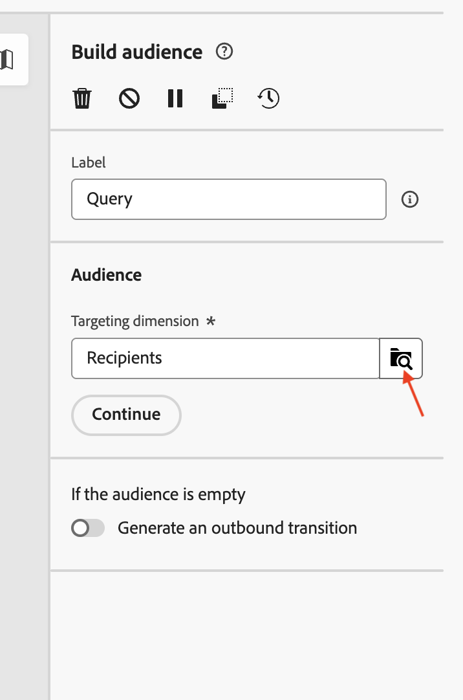
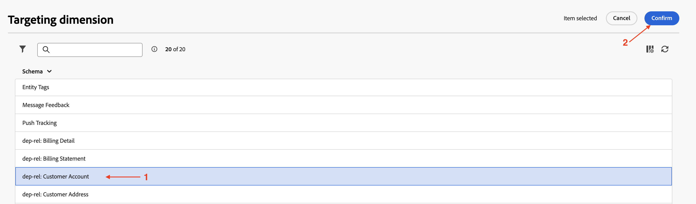
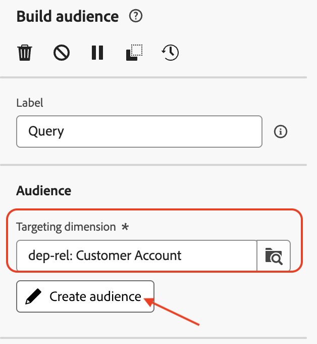
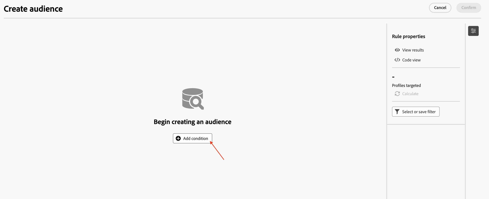
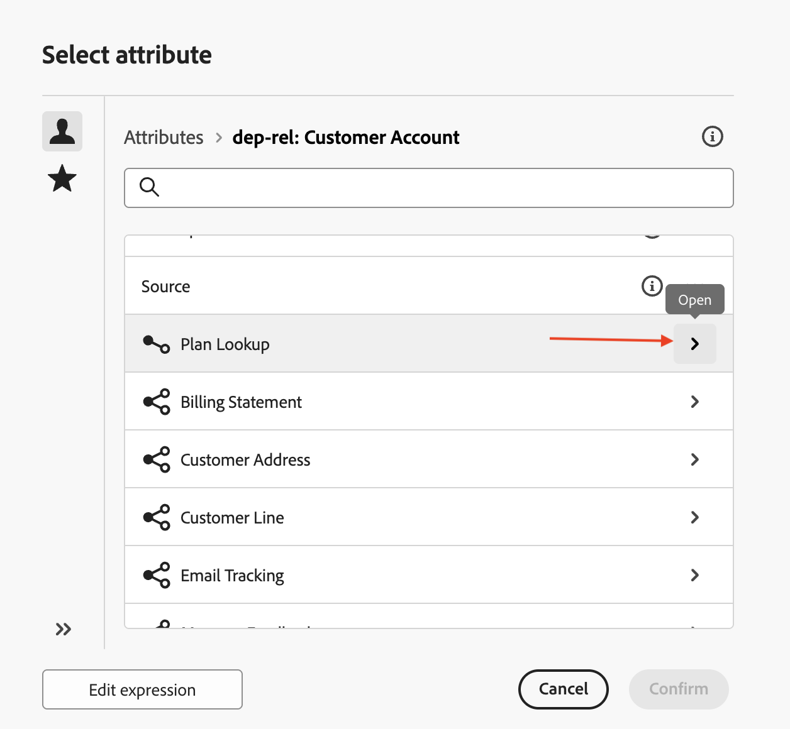
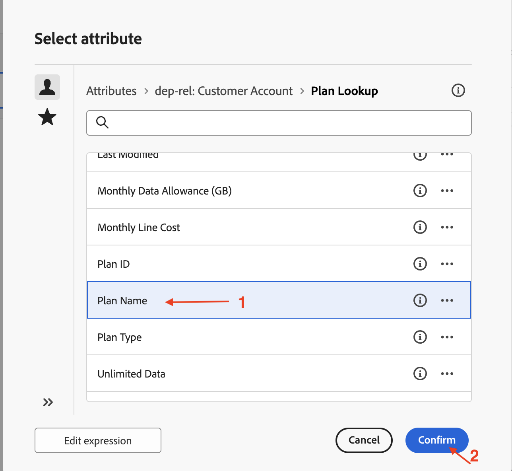
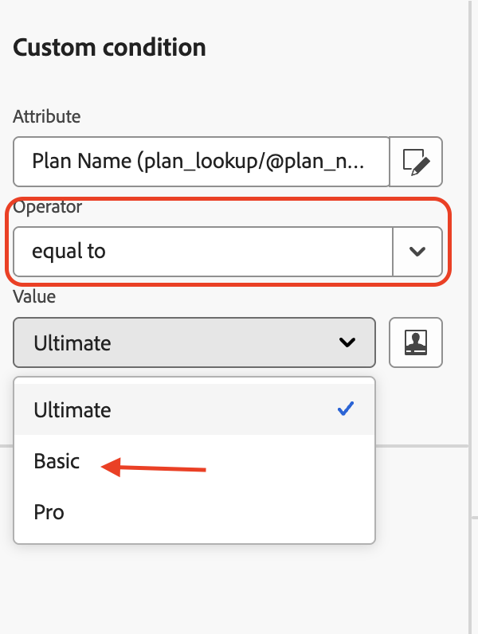
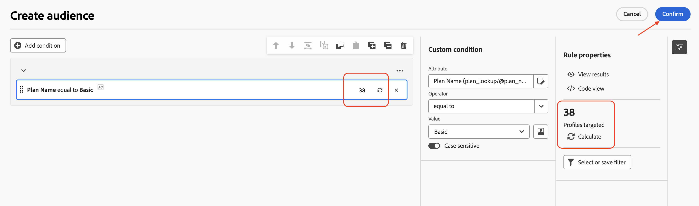

# オーディエンスの構築

## 目標

次の一連の手順では、適切なターゲティングディメンションを選択して適切な条件を設定することにより、リレーショナルスキーマからオーディエンスを構築します。 また、「更新」オプションを使用して、予想される行数を確認します。

## オーディエンスを作成

1. キャンペーンがレンダリングされたら、キャンバス内の&#x200B;**+**&#x200B;をクリックしてオプションメニューを開き、**ターゲティングアクティビティ**&#x200B;から&#x200B;**オーディエンスの構築**&#x200B;を選択します

2. **オーディエンスを作成** アクティビティが右側の詳細ペインを開き、検索アイコンをクリックして&#x200B;**ターゲティングディメンション**&#x200B;を選択します。

3. リストから`dep-rel: Customer Account`を選択し、**確認**&#x200B;をクリックします

4. **ターゲティングディメンション**&#x200B;を設定したら、「オーディエンスを作成」をクリックして、リレーショナルスキーマからオーディエンスを構築するプロセスを開始します

5. オーディエンスの詳細を作成ペインが開き、**条件を追加**&#x200B;をクリックします

6. 下にスクロールして、横にある&#x200B;**>**&#x200B;をクリックし、`dep-rel: Plan Lookup`を展開します

7. `dep-rel: Plan Name`を選択し、**確認**&#x200B;をクリックします

8. カスタム条件パネルで、演算子を「次に等しい」のままにし、「値」に対して、ドロップダウンから「基本」を選択します。

に等しいカスタム条件

>[!NOTE]
>
>選択した列で使用可能なすべての個別の値がドロップダウンに表示され、カスタム条件を簡単に作成できます。

9. カスタム条件を設定し、更新アイコンをクリックしてカウントを計算して表示します。 結果の計算に役立つ場所は2つあります

>[!NOTE]
>
>更新操作は、関係データに対して条件を評価し、期待される結果を表示します。 この操作は通常、数秒で完了し、基準を微調整して期待に応えるために非常に便利です。

10. カウント （**38**）は、指定された条件に一致するリレーショナルストアの行数を示します。 **確認**&#x200B;をクリックして、**オーディエンスの作成** ペインを終了します

>[!NOTE]
>
>ルールプロパティ セクションには、詳細を確認するためのオプションがあります。 **結果を表示**&#x200B;をクリックして、返された実際の結果を確認します。 **コードビュー** オプションを使用して、実行中のクエリを確認します。

## まとめ

リレーショナルスキーマから適切なターゲティングディメンションを選択すると、キャンペーンで「オーディエンスを作成」アクティビティを簡単に使用できるようになりました。 次に、オーディエンスの構築基準を絞り込む条件を追加し、「更新」オプションを使用して、予想される行数を確認しました。

ご興味のある方は、[こちら](https://experienceleague.adobe.com/en/docs/journey-optimizer/using/campaigns/orchestrated-campaigns/design-campaigns/build-audience)をご覧ください。
