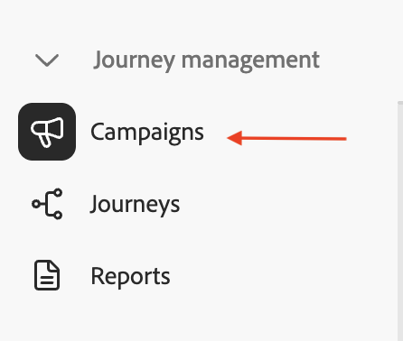
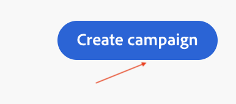

# キャンペーンの作成

## 目標

次の一連の手順では、まずオーケストレーションされたキャンペーンを作成します。

## キャンペーンを作成

1. 左側のパネルで、**キャンペーン**&#x200B;をクリックします

   

2. 「**キャンペーンを作成**」をクリック

   

3. **オーケストレーション – マーケティング**&#x200B;を選択し、**確認**&#x200B;をクリックします

   

4. 以下にキャンペーンの詳細を入力し、完了したら&#x200B;**保存ボタン**&#x200B;をクリックします
   - **名前：** `OC-MDL-Campaign-Test`
   - **説明：** `OC Message Delivery Test`

   

5. 続行する前に確認メッセージを待ちます

## まとめ

次の一連の手順で使用する基本設定をすべて設定したオーケストレーションされたキャンペーンを作成しました。
