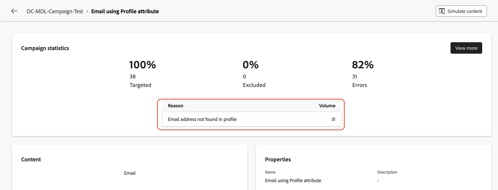
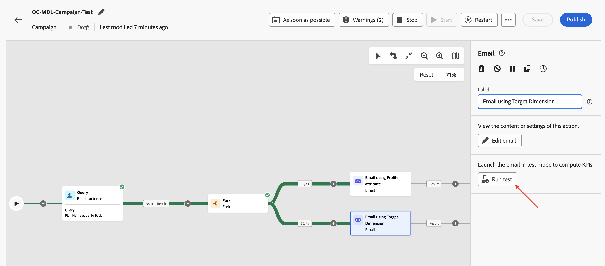
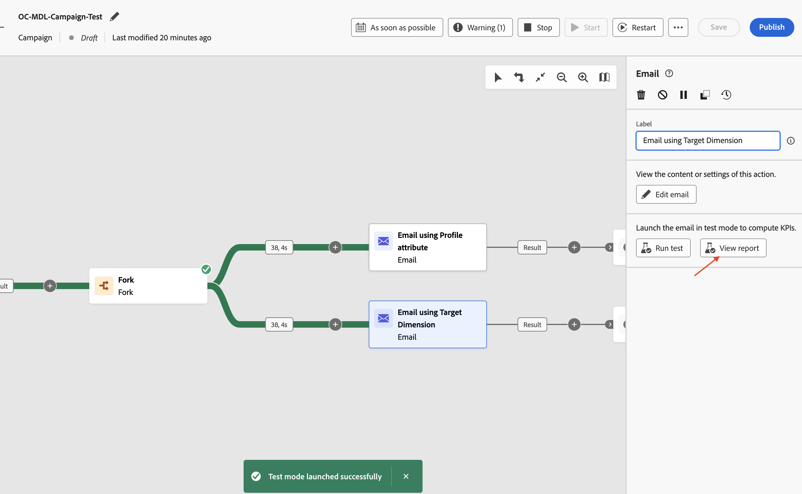

# キャンペーンのテスト

## 目標

次の一連の手順では、キャンペーンをテストモードで実行し、キャンペーンを公開する前にキャンペーン機能を想定どおりに確認します。 この場合、テストモードは実際にはメールを送信しませんが、フロー全体を検証し、問題を早期に特定するのに役立ちます。

## ワークフローを開始

1. 2つのメールフローを設定すると、キャンペーンは次のようになります。 **開始** ボタンをクリックして、**テストモード**&#x200B;でキャンペーンを実行します

>[!NOTE]
>
>前のラボで説明したように、テストモードを使用すると、キャンペーンの実行とさまざまなアクティビティの結果を検証できます。 各アクティビティは、フローの最後に達するまで順次実行されます。

&#x200B;2. すべてのキャンペーンアクティビティのテスト実行が開始され、結果を検証します

## メールレポート #1

1. メール配信をテストするには、「**プロファイル属性を使用したメール**」アクティビティをクリックし、右側のペインで「**テストを実行**」をクリックします

&#x200B;2. 確認メッセージを待ってから、**レポートを表示**&#x200B;をクリックして、電子メールテストの詳細を確認します

&#x200B;3. メールレポートページには、キャンペーン統計と実行ステータスが表示されます。 電子メールテストは、エラーがないことを確認するためのアクティビティの検証であり、電子メールを送信しません。 通常、\～**5**&#x200B;分で完了します。

>[!NOTE]
>
>最終的なテスト結果を確認するには、ページを数回更新する必要がある場合があります。

&#x200B;4. 電子メールテストが完了すると、結果が表示されます。 エラーの割合がいくつかあります。理由を確認するには、**詳細を表示**&#x200B;をクリックしてください。

&#x200B;5. 理由は`Email address not found in profile`です

>[!NOTE]
>
>メール アクティビティ用に設定された&#x200B;**配信アドレス**、**プロファイル属性**&#x200B;を使用したメールが、プロファイル属性`personalEmail.address`を使用するように設定されていたため、**AEP プロファイル**&#x200B;に依存関係が作成されました。
>
>リレーショナルスキーマの&#x200B;**38**&#x200B;件の適格な顧客IDのうち、対応するAEP プロファイルが&#x200B;**7**&#x200B;件しか見つかりませんでした。 残りの&#x200B;**31**&#x200B;では、AEP プロファイルが存在せず、`Email address not found in profile` エラーメッセージが表示されました。
>
>オーケストレーションされたキャンペーンでAEP プロファイル属性を使用する場合、データレイクおよびリレーショナルストア内のデータは&#x200B;**一貫性**&#x200B;に保たれていることを覚えておくことが重要です。

## メールレポート #2

1. Target Dimension **アクティビティを使用して、**&#x200B;電子メールに対して同じプロセスを繰り返します

&#x200B;2. 確認メッセージを待ってから、**レポートを表示**&#x200B;をクリックして、電子メールテストの詳細を確認します

&#x200B;3. 電子メールテストが完了すると、結果が表示されます。 この場合、エラーは発生しません

エラーのない

>[!NOTE]
>
>Target Dimension **を使用する電子メールアクティビティ**&#x200B;電子メールの&#x200B;**配信アドレス**&#x200B;が`dep_rel_customer_account.email`を使用するように設定されていたため、リレーショナルスキーマから、AEP プロファイルまたはその属性に依存しませんでした。
>
>すべての&#x200B;**38**&#x200B;件の適格な顧客IDには、リレーショナルストアに対応する電子メールが見つかり、エラーなしで正常にターゲットを絞り込むことができました。

## ワークフローを停止

**停止** ボタンをクリックして、キャンペーンの&#x200B;**テストモード**&#x200B;を停止します

>[!TIP]
>
>両方のメールチャネル設定は同じキャンペーン内でテストされ、AEP プロファイル属性を使用することと、メールチャネル設定でTarget Dimensionを使用することとの違いが観察されました。
>
>おめでとうございます。これで、メッセージ配信ラボが終了します。

## まとめ

これで、作成したキャンペーンをテストして、フローと動作を把握する方法を確認しました。 ここでは、テストフローの実行時に、メールチャネル設定に様々な設定を使用する仕組みがよく理解されていました。

キャンペーンテストモード [について詳しくは、](https://experienceleague.adobe.com/en/docs/journey-optimizer/using/campaigns/orchestrated-campaigns/launch/start-monitor-campaigns)を参照してください。
