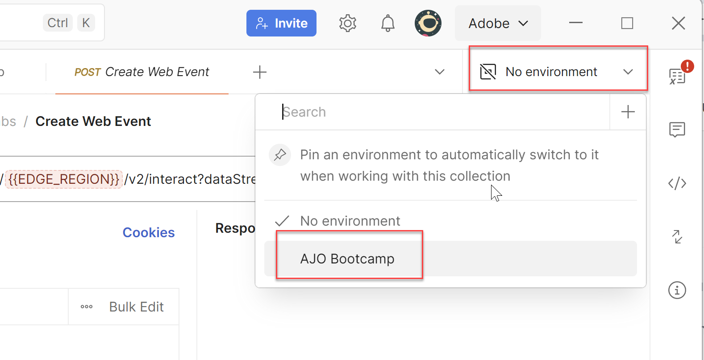

# API コレクションのインポート

## 目標

この手順では、ブートキャンプ全体で行う必要があるすべての様々なリクエストを含むAPI コレクションを読み込みます。  これらのAPI リクエストは、インポートした環境ファイルに依存しています。

## リクエスト収集をインポート

1. **AJO Bootcamp （Labs）.postman\_collection.json** ファイルをダウンロードします。

   ファイルをダウンロード — [AJO Bootcamp （Labs）.postman_collection.json](assets/ajo-bootcamp-labs.postman_collection.json)

2. 以前と同様に、「**読み込み**」ボタンをクリックします。
3. **AJO Bootcamp （Labs）.postman\_collection.json** ファイルのローカル URLを読み込みモーダルテキストボックスに貼り付けるか、読み込みダイアログボックスにドロップします。  これにより、自動読み込みがトリガーされます。
4. 読み込みプロセスが完了したら、左側のナビゲーションバーの&#x200B;**コレクション**&#x200B;をクリックし、**AJO Bootcamp （Labs）** フォルダーを展開すると、新しく読み込まれたコレクションが表示されます

>[!SUCCESS]
>
>おめでとうございます。  bootcampのPostman コレクションが正常に読み込まれました

## 環境変数の検証

読み込んだコレクションには、ブートキャンプ全体のラボに必要なすべてのAPI呼び出しが含まれています。  各ラボは、独自のリクエストのセットを持つ特定のフォルダーに編成されます。

各フォルダーの詳細は以下のとおりです。

- **プロファイルラボおよびジャーニーラボ** - Web イベントおよび出荷確認をシミュレートするイベントを送信するための一連のリクエストが含まれます。
- **Decisioning Labs** - AEP Web SDKのタグ付きサイトで通常見られるトップ ページとボトム ページの呼び出しを模倣する3人の訪問者のリクエストが含まれます。

環境とコレクションが正しく一緒に機能していることを確認するには、次の手順に従います。

1. 必要に応じて、左側のパネルの&#x200B;**コレクション**&#x200B;をクリックし、**プロファイルとジャーニーラボ** フォルダーを展開します。
2. **Web イベントの作成** リクエストをクリックすると、環境変数が&#x200B;**red**&#x200B;であることがわかります

   環境が選択されていないため、環境変数が赤で強調表示されている

3. 右上隅の&#x200B;**環境ドロップダウン**&#x200B;をクリックし、**AJO Bootcamp**&#x200B;環境を選択します。

   

4. 適切な環境を選択すると、EDGE\_REGION変数のブルーが明るくなります。 これは、変数が選択した環境の値を持つことを示します。 データストリームをまだ作成していないため、DATASTREAM\_CONFIG変数は赤のままです。そのため、その環境変数の値をまだ持っていません。 Edge\_REGIONにカーソルを合わせると、環境値の値が表示されます。

## まとめ

環境ファイルとコレクションファイルを読み込み、その使用方法を理解しました。
