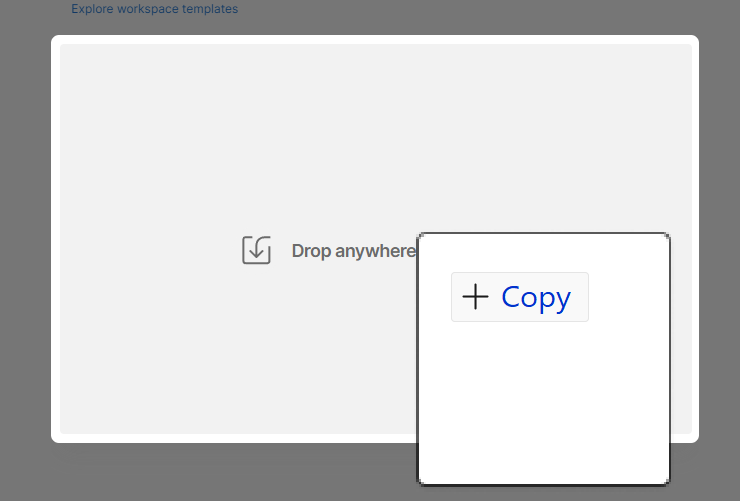
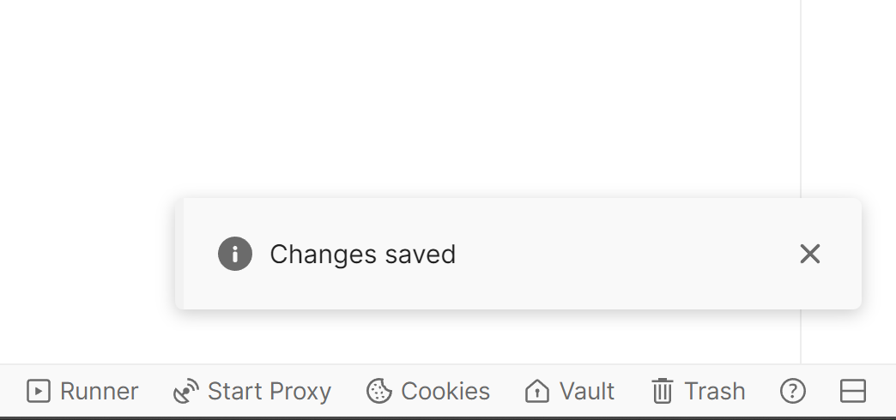

# 環境ファイルを読み込む

## 目標

このページでは、Postman環境ファイルを読み込みます。  このファイルには、bootcamp内の他のラボで行ったさまざまなAPI呼び出しの中で使用される多数のグローバル変数が含まれています。

## 環境ファイルを読み込む

1. **AJO Bootcamp.postman\_environment.json** ファイルをダウンロードします。

   ファイルをダウンロード — [AJO Bootcamp.postman_environment.json](assets/ajo-bootcamp.postman_environment.json)

2. ローカルマシンでPostmanを起動します。
3. 必要に応じて、これらのラボで使用しているWorkspaceに切り替え、「**インポート**」ボタンをクリックします。

   

4. **AJO Bootcamp.postman\_environment.json** ファイルのローカル URLを読み込みモーダルテキストボックスに貼り付けるか、読み込みダイアログボックスにドロップします。  このアクションにより、自動読み込みがトリガーされます

   ファイル URLを貼り付けるオプションを表示する

   

5. インポートしたら、左側のサイドバーの「**環境**」タブをクリックして、環境が存在することを検証します。 AJO Bootcampをご利用いただけます。

## 環境変数の設定

Postmanは、APIのテストとインタラクションを目的として設計されています。 ただし、このラボでは、ブラウザーまたはサーバーサイドのリアルタイムデータ収集呼び出しのAEP Web SDK ヒットをシミュレートするために使用します。 これらのリクエストは技術的にはAPI呼び出しですが、ヘッダーの認証トークンなどを必要とする一般的なAPI呼び出しではありません。 これらのラボの環境変数は、主にURL パスの変数（ヘッダーで使用されるものと共に）に使用されます。

1. 必要に応じて、Postmanの左側のサイドバーにある「**環境**」タブをクリックします
2. **AJO Bootcamp**&#x200B;環境ファイルをクリックします。 入力する必要がある値が表示されます

   

3. 今はDATASTREAM\_CONFIG値をスキップしてください。 データストリーム設定は、後のラボで作成します。
4. 次の表を参照して、このブートキャンプの物理的な場所に最も近いリージョンコードで&#x200B;**EDGE\_REGION** フィールドを更新します。

   | **地域** | **地域コード** |
   | ---------- | --------------- |
   | 米国西部 | or2 |
   | 米国東部 | va6 |
   | ヨーロッパ | irl1 |
   | Australia | aus3 |
   | 日本 | jpn3 |
   | アジア | spg3 |

   完了すると、環境ファイルは次のようになります。

   

5. 環境変数を保存する必要がありますが、Postman UIには「保存」ボタンはありません。 WindowsまたはMacのホットキーを使用して保存します（Windowsの場合はctrl+s）。 Postman UIの右下隅に&#x200B;**Changes saved** メッセージが表示されたら、変更内容が保存されていることがわかります。

>[!SUCCESS]
>
>おめでとうございます。 Postman Environment ファイルが完了しました
