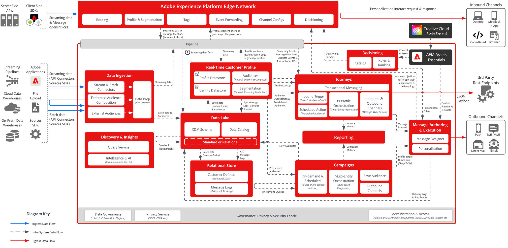

# デジタルエクスペリエンスブループリント

デジタルエクスペリエンスブループリントは、Adobe Experience Platformとアプリケーションがどのように統合および実装されているかをより深く理解するのに役立つ、システム図とデータフローアーキテクチャ図を提供します。 ブループリントは、システム間およびコンポーネントのデータとコンテンツのフロー、操作のシーケンス、依存関係を視覚的に表現し、Adobe Experience Platformとアプリケーションのユースケースの設計とアーキテクチャに役立ちます。

## 人気のブループリント

<table>
<tr>
  <td>
    
    

      <a href="experience-platform/guardrails.md">
    <strong>Experience Platform ハブとEdgeのアーキテクチャとガードレールの図 </strong>
    </a>
    

  </td>
   <td>
    
    

      <a href="experience-platform/deployment/websdk.md">
    <strong>Web SDKとEdge Networkのシーケンス図 </strong>
    </a>
    

  </td>
  <td>
    
    

      <a href="customer-journeys/journey-optimizer/journey-optimizer-overview.md">
    <strong>Adobe Journey Optimizerの概要図 </strong>
    </a>
    

  </td>
</tr>
</table>

