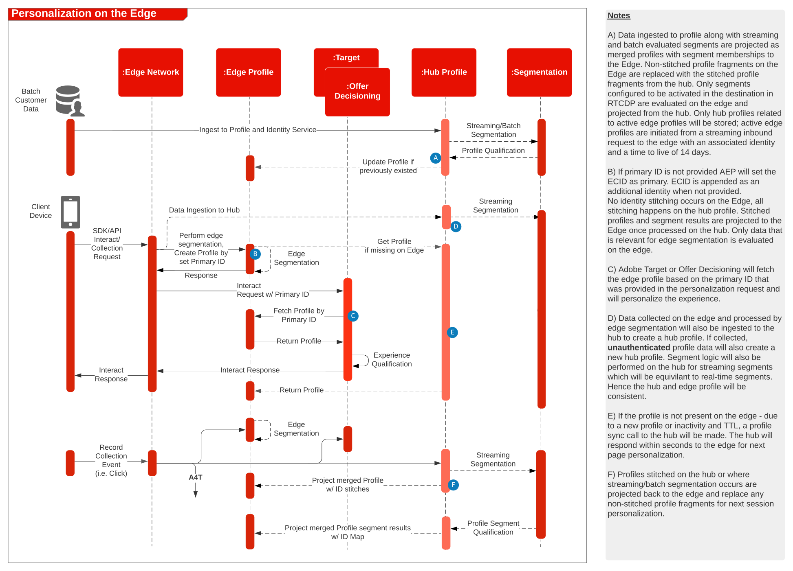

# Customer Experience Orchestration ブループリント

カスタマーエクスペリエンスオーケストレーション（以前の _デジタルエクスペリエンス_）ブループリントでは、システムとデータフローアーキテクチャ図を提供して、Adobe Experience Platformとアプリケーションがどのように統合および実装されているかをより深く理解できるようにします。 ブループリントは、システム間およびコンポーネントのデータとコンテンツのフロー、操作のシーケンス、依存関係を視覚的に表現し、Adobe Experience Platformとアプリケーションのユースケースの設計とアーキテクチャに役立ちます。

## 人気のブループリント

<table>
<tr>
  <td>
    
    

      <a href="experience-platform/guardrails.md">
    <strong>Experience Platform ハブとEdgeのアーキテクチャとガードレールの図 </strong>
    </a>
    

  </td>
   <td>
    
    

      <a href="experience-platform/deployment/websdk.md">
    <strong>Web SDKとEdge Networkのシーケンス図 </strong>
    </a>
    

  </td>
  <td>
    
    

      <a href="customer-journeys/journey-optimizer/journey-optimizer-overview.md">
    <strong>Adobe Journey Optimizerの概要図 </strong>
    </a>
    

  </td>
</tr>
</table>

