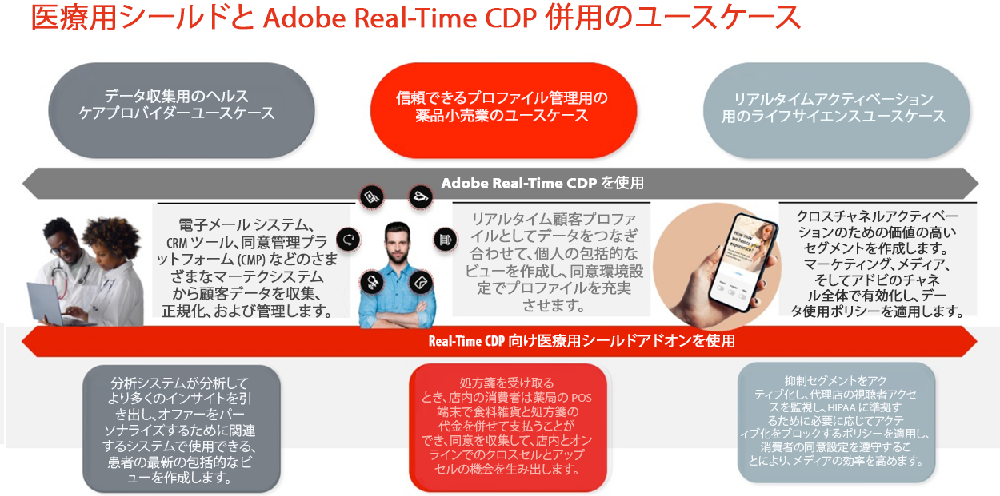
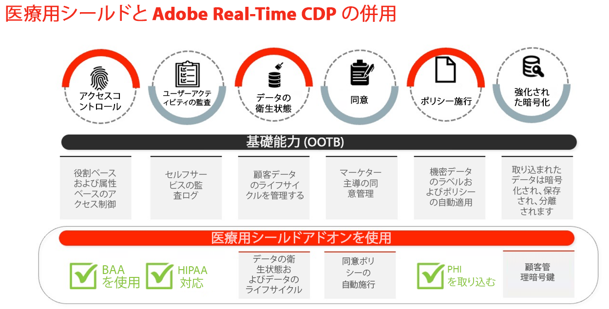
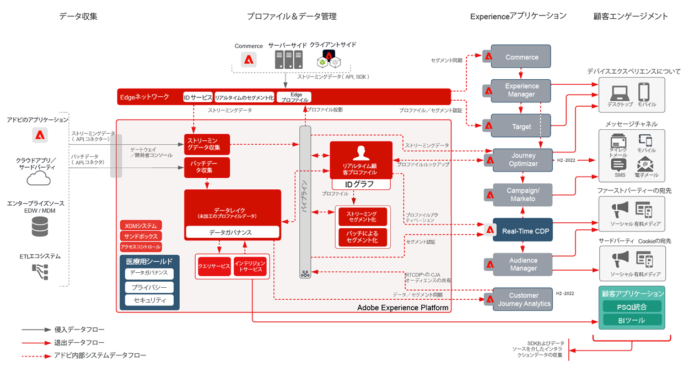
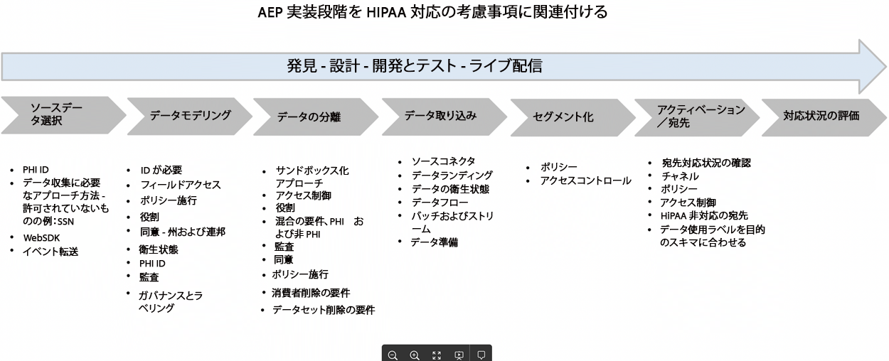
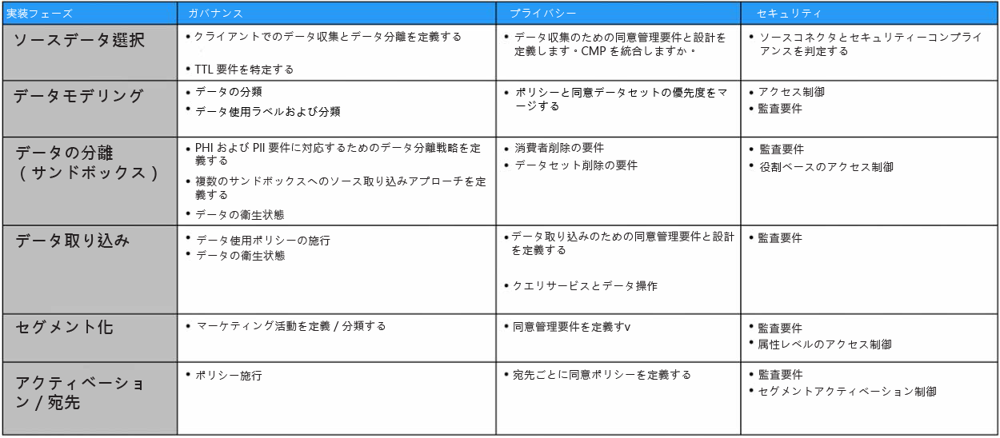

# 医療用盾

Healthcare Shield は、Real-time Customer Data Platform、Customer Journey Analytics、Adobe Journey Optimizerなど、Adobe Experience Platformベースのアプリケーションに対するAdobe Experience Platformのアドオンです。 これらのアプリケーションを HIPAA 対応にし、PHI(Protected Health Information) の処理と使用に関する要件を満たすように設計されています。

## Healthcare Shield に関するよくある質問

次の FAQ は、Healthcare Shield に関するよくある質問に対する回答を提供します。

### HIPAA とは

HIPAA は、医療保険の移植性と責任に関する法律です。 これは、ビジネスの重要な保護を確立する米国の規制です。 これらの保護は、HIPAA 対象の法人や事業関係者 (Adobeのお客様など ) が作成、受け取り、管理、または送信した保護された医療情報 (PHI) の使用と開示を、Adobeなどの技術パートナーに制限します。

Adobeは、特定の HIPAA 対応Adobeソリューションに関するビジネス関連の HIPAA 対応であり、HIPAA セキュリティ、プライバシー、および違反通知の規則に対するコンプライアンスを行います。

### BAA(Business Associate Agreement) とは何ですか？また、なぜ重要なのですか？

対象組織または事業関連者 (Adobeのお客様 ) が、事業関連者 (Adobeなど ) のサービスを使用して、保護医療データ (PHI) または ePHI（電子版 PHI）の特定の種類の消費者データを作成、受け取り、保守、送信する場合、対象組織と事業関連契約 (BAABA) に入る必要があります a).

BAA は、HIPAA のプライバシー、セキュリティ、侵害通知ルールの要件に従って PHI を適切に保護するために、ビジネス・アソシエイトとして、契約上のAdobeを必要としています。

Real-Time CDP向けの Healthcare Shield アドオンにより、Adobeは、Adobe Real-Time CDP B2C およびAdobe Real-Time CDP B2P Edition の消費者フローと共に、この機能をライセンスするお客様と BAA を実行できるようになりました。

### Real-Time CDP（および将来のプラットフォームベースのアプリケーション）向けのヘルスケアシールドは、なぜ米国でのみ利用可能なのですか？

HIPAA は米国の法律なので、医療保護シールドの可用性を米国および HIPAA の対象となる企業に限定しています。 Adobeは、地域の要件を満たし、他の地域に対しても適用範囲を拡大する予定です。

### Real-Time CDPのヘルスケアシールドとは

Real-Time CDP向けヘルスケアシールドは、Real-Time CDPの PHI をデータ取り込み、オーディエンス作成、クロスチャネルアクティベーションに使用し、BAA の実行にAdobeを必要とするお客様向けです。 HIPAA を使用する被覆事業者に対しては、リアルタイム CDP の使用例を使用する場合は、ヘルスケアシールドが必要です。

### Real-Time CDPの医療の見込み客がヘルスケア・シールドを購入する理由

Real-Time CDPのアドオンとして、Healthcare Shield は、アプリケーションを「HIPAA 対応」の状態にアップグレードします。 つまり、アプリケーションは、HIPAA の要件に従って PHI を使用するための保護措置を備えています。 また、Healthcare Shield を使用すると、Adobeは、HIPAA 対応のアプリケーションに対して、特定の種類の Permitted Sensitive Personal Data を取り込むことを、お客様に喜んで承認することができます。 Adobeは、互換性のあるプラットフォームベースのアプリケーションに対して Healthcare Shield をライセンスするお客様と Business Associate Agreement(BAA) に署名します。

### Healthcare Shield を使用したReal-Time CDPでは、どのような種類のデータが許可されていますか（どのデータが許可されていませんか）。

Healthcare Shield を使用すると、ブランドは、Real-Time CDP(Permitted Sensitive Personal Data) などのプラットフォームベースのアプリケーションに、次の PHI を取り込むことができます。

* 個人の財務情報
* 医療
* ヘルス情報

しかし、私たちは特に、未成年者、完全なアカウント番号、完全なクレジットカード番号、政府識別子（SSN など）、子供の個人情報の物質乱用、精神衛生、遺伝的健康記録、または健康記録を識別するデータを除外しています。 子どもは、どの児童保護法 ( 米国児童オンラインプライバシー法 (COPPA) に基づいて定義された個人情報など ) に基づいて保護されます。

### Healthcare Shield を使用すると、Real-Time CDPのお客様は、任意の種類の PHI を使用してオーディエンスを構築し、それらをアクティブ化できますか？

お客様が許可された機密性の高い個人データを Platform ネイティブアプリケーションに取り込む場合でも、お客様は、適用されるすべての規制に準拠し、適切な権限、同意、明確性および認証を消費者から取得し、意図した方法でデータを使用する責任を負うと理解する必要があります。

### HIPAA 対応以外のAdobe・アプリケーションで顧客データを取り込み、アクティブ化する際のニュアンスは何ですか。

お客様ライセンスのヘルスケアシールドでは、HIPAA 対応以外のAdobeアプリケーションおよびサービスで、許可された機密性の高い個人データを使用、取り込み、収集、共有、または統合できません。

例えば、Audience Manager、Adobe Target、Adobe Analyticsなどのアプリケーションで、PHI を含むセグメントをアクティブ化しないでください。 Healthcare Shield のライセンスを受けるお客様は、HIPAA 対応と見なされているかどうかに関係なく、HIPAA 対応のAdobeアプリケーションに、許可された機密の個人データまたは承認済みの PHI を取り込む場合があります。

### 非 HIPAA 対応の非Adobe・アプリケーションで顧客データを取り込み、アクティブ化する際のニュアンスは何ですか。

お客様のライセンス Healthcare Shield は、Adobe・アプリケーション以外の PHI を含むセグメントをアクティブ化する場所を判断する際に適切な判断を下す必要があります。 Adobeは、顧客スキーマのAdobeデータ使用ラベルに従ったデータの処理をサポートしない可能性のあるサードパーティプロバイダーに、顧客が送信するサードパーティプロバイダーとデータを管理（および一切の責任を負いません）しません。 また、Adobeはお客様に法的な助言を提供できません。

## 主なヘルスケアシールドの使用例

| RTCDP B2C Edition の標準的な使用例 | 説明 |
|-----|-----|
| ストリーミングデータ収集 | <ul><li>Adobe接続と非接続接続の間で使用できる、正規化された柔軟なAdobeモデル<li>B2C マーケティング用に設計された、人物およびアカウントベースのデータスキーマ。<li>タグ管理とイベント転送は、イベントレベルのデータをリアルタイムで収集し、配信します。<li> エクスペリエンスの配信を高速化するプロファイルを最適化。</li></ul> |
| 信頼済みプロファイル管理 | <ul><li>消費者属性、行動、環境設定データを含む統合プロファイル。<li> データガバナンスフレームワークは、柔軟で透明性が高く、ポリシーの作成と自動実施により、データの誤用を防ぐために、統合プロファイルに適用されます。 </li></ul> |
| リアルタイムアクティベーション | <ul><li>B2C マーケター向けのドラッグ&amp;ドロップによるセグメント化。<li>クロスチャネルアクティベーションのためのユーザーレベルおよびアカウントレベルの ID 解決とプロファイルエンリッチメント。<li> チャネルと環境 (Adobeと非Adobe) をまたいで、オーディエンスのオーケストレーションとリアルタイムのアクティベーションを通じて、一貫した顧客体験を提供します。</li></ul> |
| 顧客獲得 | <ul><li>未認証ユーザーを認識済み/認証済みユーザーに変換する方法に関するインサイト。<li>未登録ユーザーにメンバーシップの登録を促す。<li> 購読を増やしたり、獲得し直したりします。<li> 顧客プロファイルを分析して傾向を把握する ( 例：. 高価値のセグメントとパフォーマンスの低いセグメントを比較し、獲得を最適化するなど )。</li></ul> |
| 顧客エンゲージメント | <ul><li>消費者行動の最新性と頻度（オンラインとオフライン）に基づいてオファーをターゲット設定する。<li>接続されたエクスペリエンスのデジタルプロパティの統合（例えば、モバイルアプリのダウンロードを促し、チャネル間でセグメントのアクティベーションを使用してエクスペリエンスを接続します）。</li></ul> |
| 規模に応じたパーソナライゼーション | <ul><li> エッジ上のセグメントを評価して、同じページや次のページのパーソナライゼーションをリアルタイムで実現します。<li>ジャーニーをまたいでセッションを放棄した訪問者（例：買い物かごの放棄、コンバージョンに失敗した再訪問者）に一意のターゲット設定されたエクスペリエンスを提供して、エンゲージメントを強化します。<li> オフラインとオンラインの行動を統合して結び付け、ユーザーを最適化およびエンゲージメントさせます。</li></ul> |
| クロス販売/アップセル | <ul><li>ユーザーとの既存の関係を拡大および維持しながら、顧客を維持する。<li>ビジネスユニット/ブランド/オファーをまたいで新しい収益ストリームを促進し、顧客のライフタイムバリューを向上させます。<li>製品と SKU（頻繁なバンドル、価格の機密性など）をまたいで AOV に関するインサイトを得る。</li></ul> |
| 顧客維持/忠誠度 | <ul><li> 消費者を再びアクティブにして、ロイヤルティを高め、顧客の離れを避けます。&lt;.li> 好みと傾向に基づいて、価値の高い顧客向けにパーソナライズされた製品レコメンデーションをキュレーションします。<li>エンゲージメントの標準ケイデンスと、常連客向けの特別オファーを作成します。<li> オンラインとオフラインの環境設定をリンクし、複数のチャネルにわたってオファーを最適化する。</li></ul> |
| Data Collaboration | <ul><li> UI 内で手元で共有を作成し、データコラボレーションワークフローを構築します。<li>( 業界をまたいでファーストパーティのデータの重複を活用して、戦略的なビジネス上の意思決定とキャンペーンを結び付けます。<li>データのサイロを分類し、全体的なカスタマージャーニーを把握します。<li> ユースケース別に環境設定と同意に従う。</li></ul> |
| メディア/マーケティングの効率性と最適化 | <ul><li> 顧客データとアクティブ化チャネルを 1 つの記録システムで一元化および管理することで、組織の効率性を高めます。<li>効果的なメディア支出/効率性の抑制キャンペーンをサポートします。<li> ガバナンスとポリシーの実施を通じて、IT ポリシーに合わせます。<li>必要に応じてリアルタイムでデータにアクセスし、タイムリーなキャンペーンをサポートします。</li></ul> |

## 関連する技術的機能

### 相違点

| タイプ | 標準搭載 | 医療用盾 |
|-----|-----|-----|
| 暗号化 | [AEP でのデータ暗号化](https://experienceleague.adobe.com/docs/experience-platform/landing/governance-privacy-security/encryption.html?lang=en) | [AEP でのデータ暗号化](https://experienceleague.adobe.com/docs/experience-platform/landing/governance-privacy-security/encryption.html?lang=en) +顧客管理キー |
| データの衛生状態 | **基本的：** 顧客がデータのライフサイクルを管理できるセルフサービスツール。 これには、顧客データの削除、フィールドレベルの更新、データセットのデータ有効期限の設定が含まれ、期限切れになったデータを削除します。<ul><li>制限： **10,000 件の削除リクエスト** 月ごと<li>データセットの TTL 2 件の制限</li></ul> | **プレミアム**:データ衛生機能の 1 日あたりの容量/しきい値を拡張して、より大きなデータセットを短時間でキュレーションします。<ul><li>制限： **2,000,000 件の削除リクエスト** ヘルスケアシールドの一部として月単位<li>データセットの TTL 20 個の制限</li></ul> |
| 同意 | **基礎的な**:同意および環境設定関連の属性を手動でオーディエンスのセグメント化に追加することで、同意と環境設定の詳細化をおこないます。 | **プレミアム**:同意と環境設定に基づいて、顧客データの使用方法に関するポリシーを作成し、自動的に適用します。 |

### ガバナンス

**データの衛生状態**

* [データの衛生状態の概要](https://experienceleague.adobe.com/docs/platform-learn/tutorials/data-hygiene/overview.html?lang=en)
* [Adobe Experience Platformのデータの衛生状態](https://experienceleague.adobe.com/docs/experience-platform/hygiene/home.html?lang=en)

**ポリシーの適用**

* [データガバナンスの概要](https://experienceleague.adobe.com/docs/experience-platform/data-governance/home.html?lang=en)
* [データ使用ポリシーの概要](https://experienceleague.adobe.com/docs/experience-platform/data-governance/policies/overview.html?lang=en)
* [Adobe Experience Platformのガバナンス、プライバシー、セキュリティ](https://experienceleague.adobe.com/docs/experience-platform/landing/governance-privacy-security/overview.html?lang=en#consent)

### プライバシー

**同意**

* [ポリシーの自動適用](https://experienceleague.adobe.com/docs/experience-platform/data-governance/enforcement/auto-enforcement.html?lang=en#consent-policy-evaluation)

### セキュリティ

**暗号化の強化**

役立つリンク：

* [AEP セキュリティに関するホワイトペーパー](https://www.adobe.com/content/dam/cc/en/security/pdfs/AEP_SecurityOverview.pdf)

* [Adobe Experience Platformでのデータ暗号化](https://experienceleague.adobe.com/docs/experience-platform/landing/governance-privacy-security/encryption.html)

* [データ準備でのハッシュ関数](https://experienceleague.adobe.com/docs/experience-platform/data-prep/functions.html?lang=en#hashing)

* [タグデータの暗号化](https://experienceleague.adobe.com/docs/experience-platform/tags/api/guides/encrypting-values.html?lang=en)

**アクセス制御**

* [属性ベースのアクセス制御の概要](https://experienceleague.adobe.com/docs/experience-platform/access-control/abac/overview.html)

**ユーザーアクティビティの監査**

* [監査ログ](https://experienceleague.adobe.com/docs/experience-platform/landing/governance-privacy-security/audit-logs/overview.html)

**暗号化の強化**

* [Adobe Experience Platform Security の概要](https://www.adobe.com/content/dam/cc/en/security/pdfs/AEP_SecurityOverview.pdf)
* [値の暗号化](https://experienceleague.adobe.com/docs/experience-platform/tags/api/guides/encrypting-values.html?lang=en)
* [Adobe Experience Platformでのデータ暗号化](https://experienceleague.adobe.com/docs/experience-platform/catalog/data-protection.html)
* [データ準備マッピング関数 — ハッシュ](https://experienceleague.adobe.com/docs/experience-platform/data-prep/functions.html?lang=en#hashing)

**Experience Cloud**

* [Adobe Real-time Customer Data Platformと医療の盾](https://experienceleague.adobe.com/docs/customer-data-management-voices-events/events/governance/healthcare-shield.html?lang=en)

   より少ないデータへのアクセスで、エクスペリエンスプロミスで配信。 このビデオでは、Adobe Experience Platformベースのアプリケーションに対するAdobe Experience PlatformアドオンであるAdobe Real-Time CDPと Healthcare Shield の詳細を説明します。これは、HIPAA に対応し、PHI(Protected Health Data) の処理と使用に関する HIPAA 要件に対応するように設計されています。

**Experience Platform**

* [監査ログの概要](https://experienceleague.adobe.com/docs/experience-platform/landing/governance-privacy-security/audit-logs/overview.html)

   監査ログを使用して、Adobe Experience Platform で誰が何のアクションを実行したかを確認する方法を説明します。

* [データの衛生状態の概要](https://experienceleague.adobe.com/docs/experience-platform/hygiene/home.html?lang=en)

   Adobe Experience Platform Data Whealthy を使用すると、古いレコードや不正確なレコードを更新またはパージして、データのライフサイクルを管理できます。

* [ポリシーの自動適用](https://experienceleague.adobe.com/docs/experience-platform/data-governance/enforcement/auto-enforcement.html?lang=en)

   このドキュメントでは、Experience Platformで宛先に対してセグメントをアクティブ化する際に、データ使用ポリシーが自動的に適用される方法について説明します。

* [属性ベースのアクセス制御の概要](https://experienceleague.adobe.com/docs/experience-platform/access-control/abac/overview.html)

   Adobe Experience Platformの属性ベースのアクセス制御について説明します。

## HIPAA およびAdobe製品とサービス

Adobeは、医療業界のお客様のニーズに応えて、プライバシーとセキュリティに関する特定のニーズに応えるために、引き続き革新と適応を行っています。

詳しくは、 [HIPAA およびAdobe製品とサービス](https://www.adobe.com/trust/compliance/hipaa-ready.html).

## マーケティングの概要図

HIPAA 対応の製品（未対応）:

**Marketecture 図**

* グレーで示されているアプリケーションは、まだ HIPAA に対応していません。

## アプローチ

この項では、実装手順と面接フェーズについて説明します。

### 実装段階

各手順で考慮すべき側面：

この節では、従うべきベストプラクティスの概要を説明し、次の 3 つの段階に分かれています。

### 面接フェーズ

ステークホルダーとのインタビュープロセスは、以下の側面を理解する上で重要です。

* 目的：ユースケースのタイプ — コンバージョン、プロスペクティング、エンゲージメントなど
* パフォーマンス：サービス・レベルの目標の期待値
* データソース：Web/Analytics、オフライン/オンライン、CRM、ロイヤルティなど。
* データ量
* SLT/SLA 要件
* ID - ID 数、認証済みデータ処理と匿名データ処理
* データの形式：JSON、CSV など
* データの質、データ変換の必要性
* パートナーとのセグメントマッチ（共有）の計画
* インポートする外部オーディエンス
* 暗号化：デフォルトと顧客管理キー
* データの共同混在：は e-PHI と見なされる
* 同意データ収集 — OneTrust、同意 SDK
* 宛先には以下が必要です。頻度と遅延およびアクセス制御の要件
* アクセス制御
* データクリーンアップの要件
* データ更新の要件
* 警告のニーズ
* API アクセス

### 設計段階

面接プロセスに基づき、設計フェーズでは、次の事項に対応します。 言うまでもなく、デザインドキュメントをレビューし、サインオフする必要があります。 デザインドキュメントでは、次の側面をカバーできます。

* データの値：
   * ボリューム — 取り込まれたデータの量
   * 期間 — 取り込まれるデータの存在期間
   * 正確さ — プロファイルの充実度
* SLT/SLA 要件と共に AEP ガードレールを検討する
* ライセンスの使用状況
* データ分離のニーズ — 1 つまたは複数の組織の複数のサンドボックス
* データのフィルター
* データの衛生要件（データ量と頻度）
* データの削除/更新の要件を満たすプロセスと方法
* データ変換のニーズ：アップストリーム、データ準備、クエリサービス
* プライマリやその他の ID の理解と決定
* [XDM スキーマデザイン](https://experienceleague.adobe.com/docs/experience-platform/xdm/schema/composition.html?lang=en)
* データセット数、プロファイル済みとプロファイルされていない
* 結合ポリシーのデザイン
* 同意データ管理
* ガバナンス：役割、ラベル、ポリシー、マーケティングアクション、アクセス制御
* [プロファイルエンリッチメント](https://experienceleague.adobe.com/docs/experience-platform/profile/guardrails.html?lang=ja)
* エッジ/ストリーミング/バッチのセグメント化デザインの要件
* 想定される宛先とアクティベーションプラン。 HIPAA 対応の宛先のニーズのみを考慮
* Analytics 向けプラン
* アラート
* API アクセス要件の追加

### 実装フェーズ

デザインドキュメントのレビューとサインオフが完了したら、実装フェーズで次の領域に対処できます。

* 必要なサンドボックスの数：開発/テスト/実稼動
* サンドボックスへのアクセス制御
* 導入方法
* TTL のニーズと頻度（データの衛生状態）
* XDM スキーマとアクセス制御
* 同意の適用
* ガバナンス：役割、ラベル、ポリシー、マーケティングアクション
* セグメント化
* データセットとアクセス制御
* データの衛生状態の設定
* 宛先の設定とアクセス制御
* アラートの設定
* API アクセス要件の実装
* モックデータで終わるまでテストを終了
