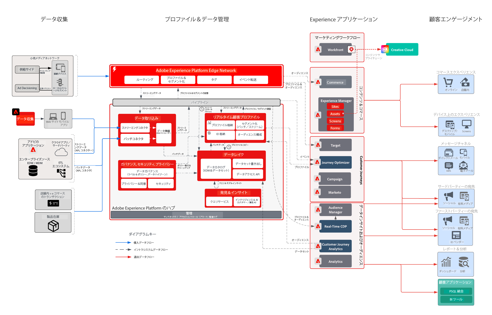

# 小売業界のビジネス課題

この統合エクスペリエンスビジネスは、カスタマージャーニー全体をパーソナライズして、ロイヤルティを向上させ、既存の顧客に対してアップセルし、キャンペーン全体でのマーケティング費用を改善しようとしました。目標達成のための戦略は、デジタル機能を拡張して、オフラインの顧客データとトランザクションデータを含めることにより、成長を促進することです。

## アドビのアプローチ

* リアルタイムでアクティブ化できる、関連するすべてのオンラインおよびオフラインのデータを含む統合顧客プロファイルを生成する
* 初回または 2 回目の購入行動を促進するために、web、メディア、プッシュチャネルにわたって顧客インタラクションをオーケストレートします。

## 提供されるビジネスバリュー

| 目標 | 戦術 | 解放されたバリュー |
|---|---|---|
| **リアルタイムカスタマージャーニーのオーケストレート&#x200B;**  **新規顧客からのリピート購入の促進&#x200B;**  **マーケティング効率の向上とメディアコストの削減**</ul> | <ul><li>包括的なリアルタイムプロファイルを実現する堅牢なデータと ID 戦略。</li><li>顧客およびトランザクションデータをリアルタイムでストリーミング（過去 90 日間の履歴を含む）</li><li>広告ネットワークと Adobe Target に対してストリーミングセグメント化を行い、メディアコストとパーソナライゼーションに対する取り組みを強化します。</li><li>パフォーマンスを測定する戦略を含む、Adobe Campaign 全体にわたるリアルタイムのカスタマージャーニー</li></ul> | <ul><li><strong>Real-time Customer Data Platform：</strong>メディア、メール、プッシュ、web をまたいでリアルタイムのカスタマーエクスペリエンスを提供</li><li><strong>データソース：</strong>この小売業者のプロファイルストア、注文システム、製品カタログ、小売店の各アウトレットをカバーするストリーミングデータ。</li><li><strong>リアルタイムメディアアクティベーション：</strong>アトリビューションおよび広告抑制のために広告ネットワークに対してセグメントをストリーミング</li><li><strong>リアルタイム web パーソナライゼーション：</strong>小売業者の web エクスペリエンスでアクティブ化するために Adobe Target に対してセグメントをストリーミング。</li><li><strong>大規模な Journey Orchestration：</strong>利用可能な顧客データで強化されたリアルタイムのトリガーメッセージ、メールやプッシュチャネルへのリアルタイムのアクティブ化</li></ul> |

## ユースケース

| カテゴリ | 目標 | ユースケース | 説明 |
|:----|:----|:----|:----|
| カスタマージャーニー | 獲得 | ウェルカムシリーズ | ビジネス、製品およびサービスを紹介して、新規の購読者を歓迎します。 |
| | | 第 1 回購入プログラム | |
| | 売り上げ向上 | 放棄された買い物かご／閲覧 | 見込み購入者の引き戻しと売り上げの促進 |
| | | 製品レビュー／クロスセル | 製品レビューを使用して、より多くの商品をクロスセルします。 |
| | | 製品プロモーション |  |
| | | 再注文の時期 | 周期的な製品／サービスの定期的なリマインダー |
| | ブランドロイヤルティ | ウィンバック | 非アクティブになった顧客を引き戻します。 |
| | | 誕生日リマインダー | 誕生日を祝うことで、顧客とのよりパーソナルな関係を育成します。 |
| マーチャンダイジング | 在庫管理 | 再入荷 | 希望する製品が再入荷したことを顧客に示し、在庫を向上させます。 |
| | | 次善のカテゴリ | ユーザーに最適なカテゴリ／販売を特定します。 |
| | | ベストセラー | |
| | | 価格下落リマインダー | 気に入った商品の価格が下がったことをユーザーに示します。 |
| | | 類似製品 |  |
| パーソナライズ | コンバージョン増加 | クーポン／オファー | 顧客に対して最適なオファー／クーポンを表示します。 |
| | | パーソナライズされた製品検索 | 検索エクスペリエンスを向上させます。 |
| | | 製品のレコメンデーション | 製品のブラウジングエクスペリエンスを向上させます。 |
| | | オムニチャネルエクスペリエンス | すべてのチャネルをまたいで顧客にリーチします。 |
| 測定 | カスタマージャーニーを理解 | クロスチャネルキャンペーン | クロスチャネルキャンペーンを測定します。 |
| | | セグメントの効果 | セグメントの効果と貢献度を理解します。 |
| | | フォールアウトレポート | 各段階でのコンバージョンを視覚化します。 |
| | | コホート分析 | セグメントグループ間のエンゲージメントを測定します。 |
| | | クリックトゥブリックレポート | 顧客コンバージョンが店舗内エクスペリエンスにどのように結び付くかを確認します。 |
| | | アトリビューション | 購入コンバージョンに最も影響を与えているタッチポイント／エクスペリエンスを表示します。 |
| | | 予測インサイト | 顧客傾向を詳しく理解します。 |

## アーキテクチャ

## 関連するブループリント

| ユースケース／統合 | リンク |
|:----|:----|
| CJA + AEP | [Customer Journey Analytics ブループリントの概要](https://experienceleague.adobe.com/docs/blueprints-learn/architecture/customer-journey-analytics/overview.html?lang=ja) |
| | [Customer Journey Analytics - ユースケース](https://experienceleague.adobe.com/docs/analytics-platform/using/cja-usecases/cja-usecases.html?lang=ja) |
| AJO + AEP | [Adobe Journey Optimizer - ユースケース](https://experienceleague.adobe.com/docs/blueprints-learn/architecture/customer-journeys/journey-optimizer/journey-optimizer.html?lang=ja) |
| | [意思決定管理](https://experienceleague.adobe.com/docs/blueprints-learn/architecture/customer-journeys/journey-optimizer/decision-management/decision-management-overview.html?lang=ja) |
| RTCDP + AEP | [オンライン／オフラインオーディエンスアクティベーション](https://experienceleague.adobe.com/docs/blueprints-learn/architecture/audience-activation/known-customer-audience-activation/known.html?lang=ja) |
| | [Experience Platform + アプリケーションアクティベーション](https://experienceleague.adobe.com/docs/blueprints-learn/architecture/audience-activation/platform-and-applications.html?lang=ja) |
| Marketo + AEP | [B2B アクティベーションとマーケティング](https://experienceleague.adobe.com/docs/blueprints-learn/architecture/b2b-activation/overview.html?lang=ja) | |
| Target + AEP | [Adobe Target のユースケース - 行動による web およびモバイルのパーソナライゼーション](https://experienceleague.adobe.com/docs/blueprints-learn/architecture/web-personalization/behavioral.html?lang=ja) | [既知の顧客データを使用した web およびモバイルのパーソナライゼーション](https://experienceleague.adobe.com/docs/blueprints-learn/architecture/web-personalization/known-personalization.html?lang=ja) | |
