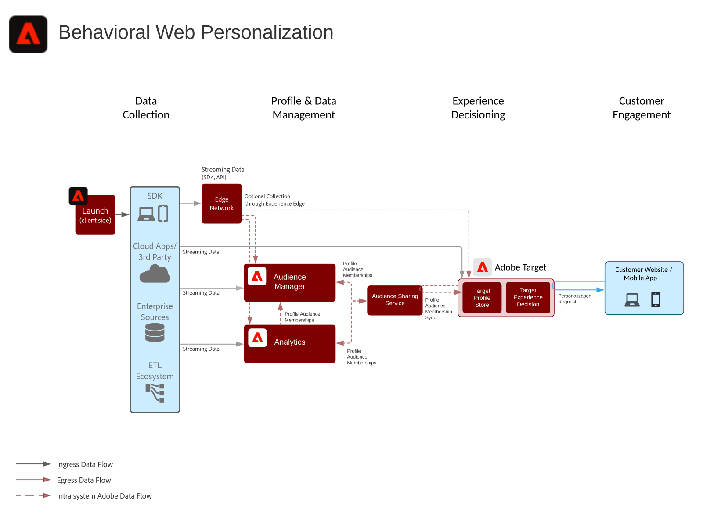
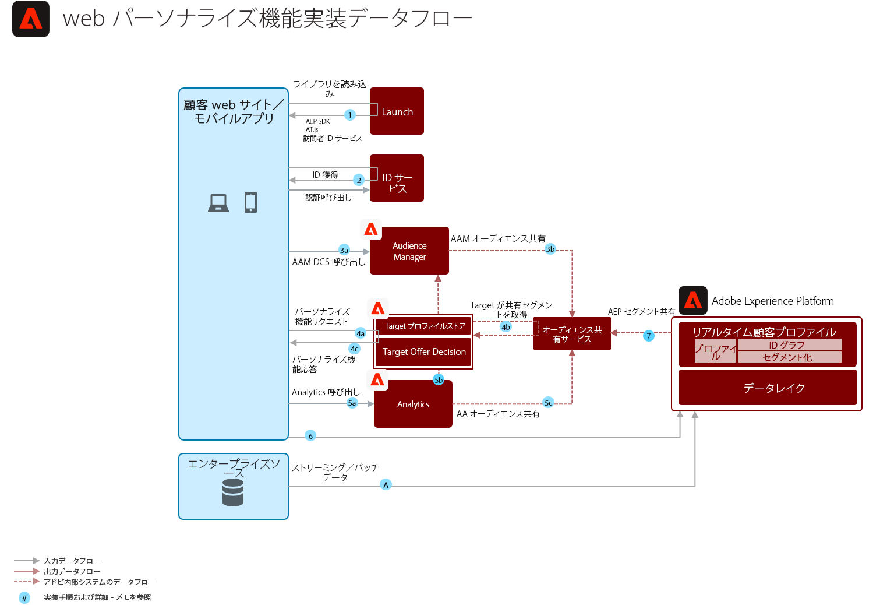

# 行動分析Web/モバイルパーソナライゼーションBlueprint

オンライン行動およびオーディエンスデータに基づいてパーソナライズします。

## 使用例

* ランディングページ最適化
* 行動ターゲティング
* 旧製品/コンテンツ表示、製品/コンテンツアフィニティ、環境属性、サードパーティオーディエンスデータ、人口統計に基づくパーソナライズ

## アプリ

* Adobe Target
* Adobe Analytics（オプション）
* Adobe Audience Manager（オプション）

## 建築

## ガードレール

セグメント共有サービスでは、デフォルトで各Adobe Analyticsレポートスイートで最大75オーディエンスを共有できます。 Audience Managerをオーディエンス共有に使用する場合、共有できるオーディエンスの数に制限はありません。 

## 実装パターン

Web/モバイルパーソナライゼーションのBlueprintは、以下に説明する方法で実装できます。

1. プラットフォームWeb SDK/モバイルSDKとEdge Networkを使用する。
1. 従来のアプリケーション固有のSDK（AppMeasurement.jsなど）の使用

### 1.プラットフォームWeb/モバイルSDKとエッジアプローチ

### 2.アプリケーション固有のSDKアプローチ

## 導入の前提条件

| 申し込み/サービス | 必要なライブラリ | メモ |
|---|---|---|
| Adobe Target | プラットフォームWeb SDK*、at.js 0.9.1以降、またはmbox.js 61+ | at.jsは、mbox.jsが開発されなくなったので、推奨されます。 |
| Adobe Audience Manager（オプション） | プラットフォームWeb SDK*またはdil.js 5.0+ |  |
| Adobe Analytics（オプション） | プラットフォームWeb SDK*またはAppMeasurement.js 1.6.4以降 |  |
| Experience CloudIDサービス | プラットフォームWeb SDK*またはVisitorAPI.js 2.0以降 |  |
| Experience PlatformモバイルSDK（オプション） | iOSおよびAndroid™の場合は4.11以降 |  |
| Experience PlatformWeb SDK | 1.0、現在のExperience PlatformSDKバージョンでは、[様々な使用例がExperience Cloudアプリケーションでまだサポートされていません](https://github.com/adobe/alloy/projects/5) |  |

## 導入手順

1. [Webアプリケーションまたはモバイルアプリケ](https://experienceleague.adobe.com/docs/target/using/implement-target/implementing-target.html) ーション用にAdobeターゲットを実装します。

   Audience ManagerまたはAnalyticsを使用している場合：

1. [Adobe Audience Managerの実装](https://experienceleague.adobe.com/docs/audience-manager/user-guide/implementation-integration-guides/implement-audience-manager.html)
1. [Adobe Analyticsの実装](https://experienceleague.adobe.com/docs/analytics/implementation/home.html)
1. [Experience CloudIDサービスの実装](https://experienceleague.adobe.com/docs/id-service/using/implementation/implementation-guides.html)

   >[!NOTE]
   >
   >各アプリケーションでExperience CloudIDを使用し、同じExperience Cloud組織に属している必要があります。これにより、複数のアプリケーション間でオーディエンスを共有できます。

1. [ユーザーとオーディエンス共有サービスのプロビジョニングを要求する(共有オーディエンス)](https://www.adobe.com/go/audiences)
1. [Adobe Analytics](https://experienceleague.adobe.com/docs/analytics/components/segmentation/segmentation-workflow/seg-build.html)または[Adobe Audience Manager](https://experienceleague.adobe.com/docs/audience-manager/user-guide/features/segments/segment-builder.html)にセグメントを作成し、[Experience Cloud](https://experienceleague.adobe.com/docs/analytics/components/segmentation/segmentation-workflow/seg-publish.html)に共有するオーディエンスを設定します(Audience ManagerまたはAdobe Analyticsを使用している場合)
1. Adobe Targetでオーディエンスが入手できたら、それらを[Adobe Target](https://experienceleague.adobe.com/docs/target/using/audiences/target.html)でのエクスペリエンスをターゲット設定するために使用できます。

## 関連ドキュメント

* [Experience Cloudオーディエンス](https://experienceleague.adobe.com/docs/core-services/interface/audiences/audience-library.html)
* [Audience ManagerとAdobe Targetの統合](https://experienceleague.adobe.com/docs/audience-manager/user-guide/implementation-integration-guides/integration-other-solutions/aam-target-integration.html)
* [Adobe Audience Managerを通じたAdobe Analyticsセグメント共有](https://experienceleague.adobe.com/docs/analytics/components/segmentation/segmentation-workflow/seg-publish.html)

## 関連するブログ投稿

* [[!DNL Blueprint for Web Personalization using Adobe Experience Platform Real-Time Customer Profile]](https://medium.com/adobetech/blueprint-for-web-personalization-using-adobe-experience-platform-real-time-customer-profile-fef2ce7a4b2f)
* [[!DNL Integrating Adobe Experience Platform Decisioning Engine with AEM Websites]](https://jaeness.medium.com/integrating-adobe-experience-platform-decisioning-engine-with-aem-websites-9c222acd12e2)
* [[!DNL How Adobe Experience Platform Predictive Audiences improves Personalized Experiences]](https://medium.com/adobetech/how-adobe-experience-platform-predictive-audiences-improves-personalized-experiences-1f75a60cb7a3)
* [[!DNL Adobe Experience Platform Web SDK for Audience Management]](https://medium.com/adobetech/adobe-experience-platform-web-sdk-for-audience-management-751fa6d063bc)
* [[!DNL Implementing Adobe Experience Platform Real-Time Customer Profile through our “Customer Zero” Program]](https://medium.com/adobetech/implementing-adobe-experience-platform-real-time-customer-profile-through-our-customer-zero-32e7cd952896)
* [[!DNL How Adobe Experience Platform Can Help Customers Personalize Their Mobile Messaging in Real-Time with Journey Orchestration Service and a Mobile Messaging Vendor]](https://medium.com/adobetech/how-adobe-experience-platform-helped-a-client-personalize-their-mobile-messaging-in-real-time-with-7d634aefa098)
* [[!DNL Segmentation in Seconds: How Adobe Experience Platform Made Real-time Customer Profiles a Reality]](https://medium.com/adobetech/segmentation-in-seconds-how-adobe-experience-platform-made-real-time-customer-profiles-a-reality-a7a8552b0847)
