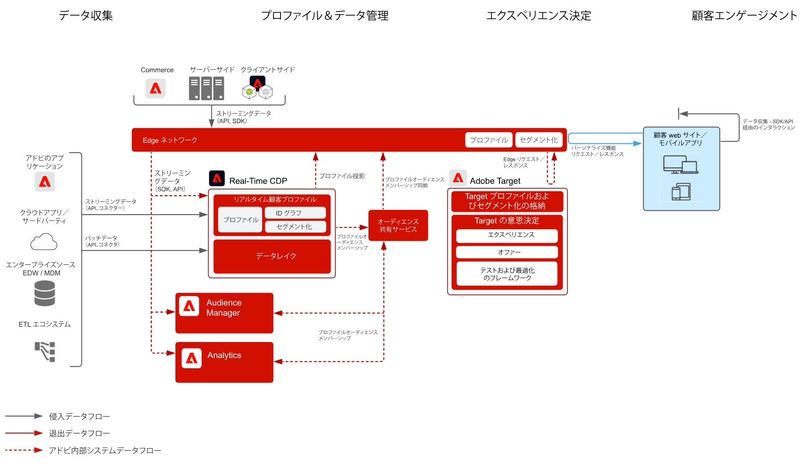

# 行動による web／モバイルパーソナライズ機能ブループリント

オンライン行動およびオーディエンスデータに基づいてパーソナライズします。

## ユースケース

* ランディングページの最適化
* 行動ターゲティング
* 以前の製品／コンテンツ表示、製品／コンテンツの親和性、環境属性、サードパーティオーディエンスデータおよび人口統計に基づいたパーソナライズ機能

## アプリケーション

* Adobe Target
* Adobe Analytics（オプション）
* Adobe Audience Manager（オプション）

## アーキテクチャ

## ガードレール

デフォルトでは、セグメント共有サービスを使用すると、各 Adobe Analytics レポートスイートで最大 75 のオーディエンスを共有できます。Audience Manager をオーディエンス共有に使用している場合、共有できるオーディエンスの数に制限はありません。 

## 実装パターン

Web／モバイルパーソナライズ機能ブループリントは、以下に説明する方法で実装できます。

1. [!UICONTROL Platform Web SDK] または [!UICONTROL Platform Mobile SDK] と[!UICONTROL エッジネットワーク]を使用。
1. 従来のアプリケーション固有 SDK（AppMeasurement.js など）を使用

### 1. Platform Web／Mobile SDK およびエッジアプローチ

[Experience Platform Web および Mobile SDK のブループリントを参照してください。](../data-ingestion/websdk.md)

### 2. アプリケーション固有 SDK アプローチ

## 実装の前提条件

| アプリケーション／サービス | 必須ライブラリ | メモ |
|---|---|---|
| Adobe Target | [!UICONTROL Platform Web SDK]*、at.js 0.9.1 以降または mbox.js 61 以降 | mbox.js は今後開発されないため、at.js をお勧めします。 |
| Adobe Audience Manager（オプション） | [!UICONTROL Platform Web SDK]* または dil.js 5.0 以降 |  |
| Adobe Analytics（オプション） | [!UICONTROL Platform Web SDK]* または AppMeasurement.js 1.6.4 以降 |  |
| Experience Cloud ID サービス | [!UICONTROL Platform Web SDK]* または VisitorAPI.js 2.0 以降 |  |
| Experience Platform Mobile SDK（オプション） | 4.11 以降（iOS および Android™ 用） |  |
| Experience Platform Web SDK | 現在の Experience Platform SDK バージョンである 1.0 には、[Experience Cloud アプリケーションをまだサポートしていない様々なユースケースがあります](https://github.com/adobe/alloy/projects/5) |  |

## 実装手順

1. Web またはモバイルアプリケーション用に [Adobe Target を実装](https://experienceleague.adobe.com/docs/target/using/implement-target/implementing-target.html?lang=ja)します。

   Audience Manager または Adobe Analytics を使用する場合：

1. [Adobe Audience Manager を実装](https://experienceleague.adobe.com/docs/audience-manager/user-guide/implementation-integration-guides/implement-audience-manager.html?lang=ja)します
1. [Adobe Analytics を実装](https://experienceleague.adobe.com/docs/analytics/implementation/home.html?lang=ja)します
1. [Experience Cloud ID サービスを実装](https://experienceleague.adobe.com/docs/id-service/using/implementation/implementation-guides.html?lang=ja)します

   >[!NOTE]
   >
   >アプリケーション間のオーディエンス共有を許可するためには、各アプリケーションは、Experience Cloud ID を使用し、同じ Experience Cloud 組織に属している必要があります。

1. [ユーザーおよびオーディエンス共有サービス（共有オーディエンス）のプロビジョニングをリクエスト](https://www.adobe.com/go/audiences)します
1. [Adobe Analytics](https://experienceleague.adobe.com/docs/analytics/components/segmentation/segmentation-workflow/seg-build.html?lang=ja) または [Adobe Audience Manager](https://experienceleague.adobe.com/docs/audience-manager/user-guide/features/segments/segment-builder.html?lang=ja) でセグメントを作成し、[これらのオーディエンスを Experience Cloud に共有するように設定](https://experienceleague.adobe.com/docs/analytics/components/segmentation/segmentation-workflow/seg-publish.html?lang=ja)します（Audience Manager または Adobe Analytics を使用している場合）
1. オーディエンスが Adobe Target で使用できるようになったら、[Adobe Target によるターゲティングエクスペリエンス](https://experienceleague.adobe.com/docs/target/using/audiences/target.html?lang=ja)で使用できます

## 関連ドキュメント

* [Experience Cloud Audiences](https://experienceleague.adobe.com/docs/core-services/interface/audiences/audience-library.html?lang=ja)
* [Audience Manager と Adobe Target の統合](https://experienceleague.adobe.com/docs/audience-manager/user-guide/implementation-integration-guides/integration-other-solutions/aam-target-integration.html?lang=ja)
* [Adobe Audience Manager を使用した Adobe Analytics セグメント共有](https://experienceleague.adobe.com/docs/analytics/components/segmentation/segmentation-workflow/seg-publish.html?lang=ja)

## 関連するブログ投稿

* [[!DNL Blueprint for Web Personalization using Adobe Experience Platform Real-Time Customer Profile]](https://medium.com/adobetech/blueprint-for-web-personalization-using-adobe-experience-platform-real-time-customer-profile-fef2ce7a4b2f)
* [[!DNL Integrating Adobe Experience Platform Decisioning Engine with AEM Websites]](https://jaeness.medium.com/integrating-adobe-experience-platform-decisioning-engine-with-aem-websites-9c222acd12e2)
* [[!DNL How Adobe Experience Platform Predictive Audiences improves Personalized Experiences]](https://medium.com/adobetech/how-adobe-experience-platform-predictive-audiences-improves-personalized-experiences-1f75a60cb7a3)
* [[!DNL Adobe Experience Platform Web SDK for Audience Management]](https://medium.com/adobetech/adobe-experience-platform-web-sdk-for-audience-management-751fa6d063bc)
* [[!DNL Implementing Adobe Experience Platform Real-Time Customer Profile through our “Customer Zero” Program]](https://medium.com/adobetech/implementing-adobe-experience-platform-real-time-customer-profile-through-our-customer-zero-32e7cd952896)
* [[!DNL How Adobe Experience Platform Can Help Customers Personalize Their Mobile Messaging in Real-Time with Journey Orchestration Service and a Mobile Messaging Vendor]](https://medium.com/adobetech/how-adobe-experience-platform-helped-a-client-personalize-their-mobile-messaging-in-real-time-with-7d634aefa098)
* [[!DNL Segmentation in Seconds: How Adobe Experience Platform Made Real-time Customer Profiles a Reality]](https://medium.com/adobetech/segmentation-in-seconds-how-adobe-experience-platform-made-real-time-customer-profiles-a-reality-a7a8552b0847)
