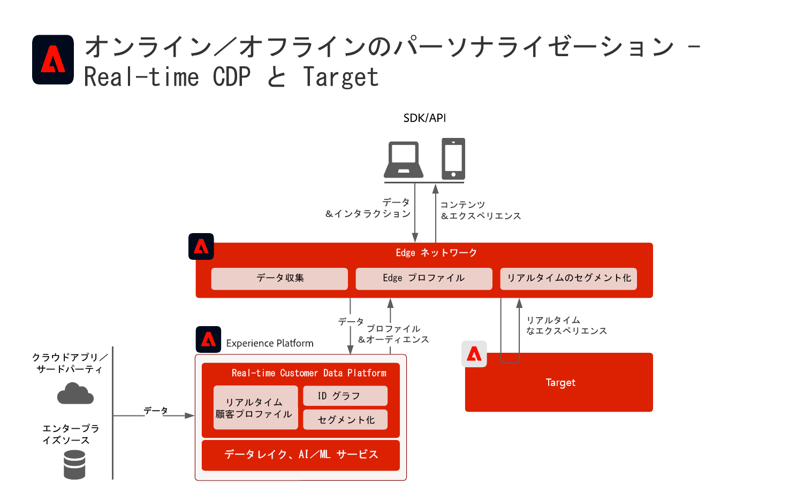
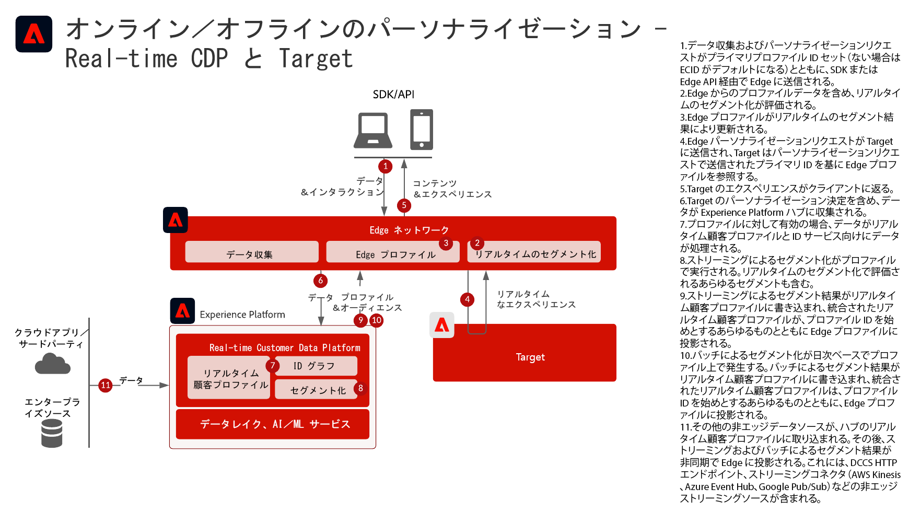
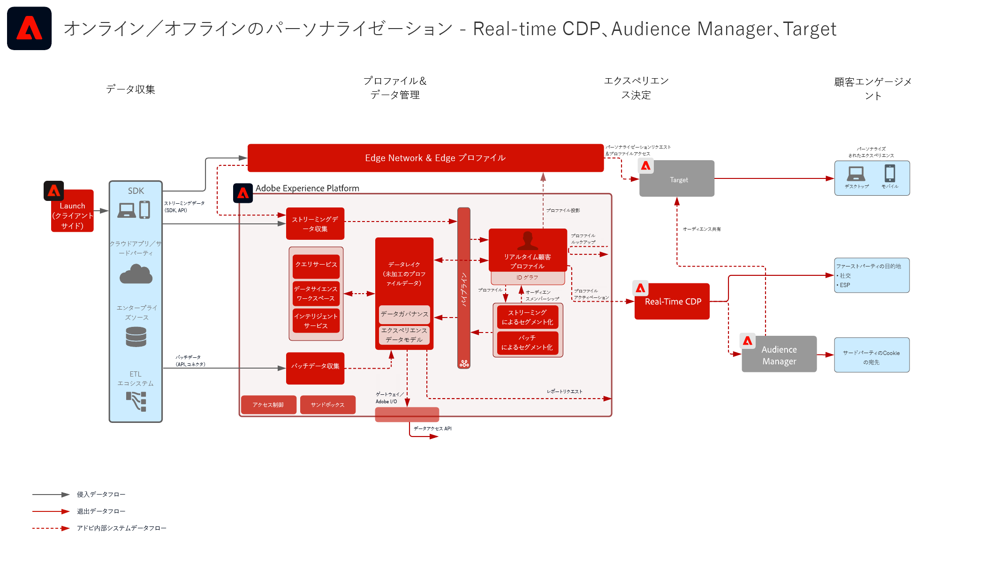
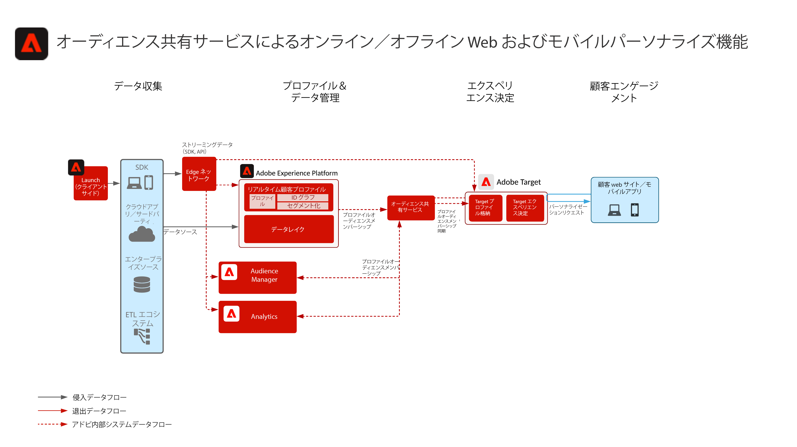
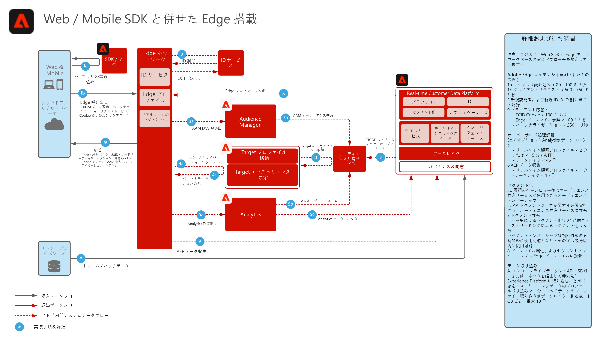
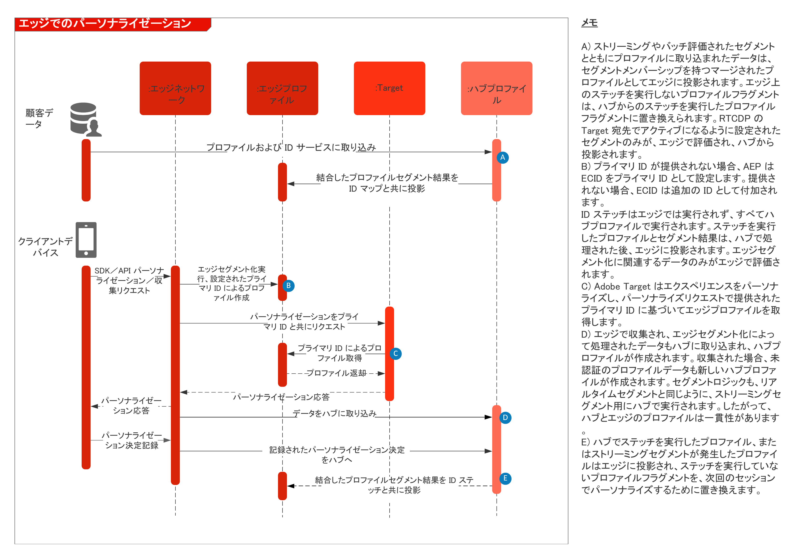

# オンラインとオフラインのデータを使用した Web／モバイルのパーソナライズ機能

## ユースケース

* オンラインとオフラインのデータと既知のプロファイルを使用したオンラインパーソナライゼーション
* ランディングページの最適化
* トランザクション、ロイヤリティ、CRM データ、およびモデル化されたインサイトなどのオフラインデータに加えて、以前の製品／コンテンツ表示、製品／コンテンツの親和性、環境属性、および人口統計に基づいたパーソナライズ機能
* Adobe Target を使用して、Real-time Customer Data Platform で定義されたオーディエンスを Web サイトやモバイルアプリで共有、およびターゲット設定します。

## アプリケーション

* [!UICONTROL Real-time Customer Data Platform]
* Adobe Target
* Adobe Audience Manager（オプション）：サードパーティオーディエンスデータ、Co-op ベースのデバイスグラフ、Adobe Analytics でReal-time Customer Data Platform オーディエンスを表示する機能および Real-time Customer Data Platform で Adobe Analytics オーディエンスを表示する機能を追加
* Adobe Analytics（オプション）：Adobe Analytics データからの履歴行動データおよび詳細なセグメント化に基づいてセグメントを作成する機能を追加

## 使用例のシナリオ

<table class="tg" style="undefined;table-layout: fixed; width: 790px">
<colgroup>
<col style="width: 20px">
<col style="width: 276px">
<col style="width: 229px">
<col style="width: 265px">
</colgroup>
<thead>
  <tr>
    <th class="tg-y6fn">#</th>
    <th class="tg-f7v4">使用例のシナリオ</th>
    <th class="tg-y6fn">機能</th>
    <th class="tg-f7v4">前提条件</th>
  </tr>
</thead>
<tbody>
  <tr>
    <td class="tg-0lax">1</td>
<td class="tg-73oq">Real-time Customer Data Platform から Target に共有される Edge に関するリアルタイムのセグメント評価</td>
    <td class="tg-0lax">- Edge 上で同じまたは次のページのパーソナライズ機能に対して、リアルタイムでオーディエンスを評価します。 - さらに、ストリーミングやバッチ方式で評価されたセグメントも Edge ネットワークに投影され、Edge セグメントの評価とパーソナライズ機能に含められます。</td>
    <td class="tg-73oq">- 実装パターン 1 （下記参照）。 - Web/Mobile SDK を実装する必要があります。 - Mobile SDK および API ベースのリアルタイムセグメント化のサポートは、現在利用できないことにご注意ください - データストリームは、 Experience Edge で、Target と Experience Platform の拡張を有効にして設定する必要があります。データストリーム ID は、Target の宛先設定で提供されます。 - Target の宛先は、Real-time Customer Data Platform で設定する必要があります。 - Target との統合には、Experience Platform インスタンスと同じ IMS Org が必要です。</td> 
  </tr>
  <tr>
    <td class="tg-0lax">2</td>
    <td class="tg-73oq">- Edge アプローチを通じて、Real-time Customer Data Platform から Target へのストリーミングおよびバッチオーディエンスを共有</td>
    <td class="tg-0lax">- Edge ネットワークを通じて、Real-time Customer Data Platform から Target へのストリーミングおよびバッチオーディエンスを共有します。リアルタイムで評価される Audience には、WebSDK と、統合パターン 1 で概要を説明したリアルタイムのオーディエンス評価が必要です。 - この統合は通常、統合パターン 1 で概要を説明しているように、リアルタイムだけでなく、ストリーミングオーディエンスとバッチオーディエンスを強化する Edge コレクションと WebSDK に移行する代わりに、従来の SDK を使用してストリーミングオーディエンスとバッチオーディエンスを共有します。</td>
    <td class="tg-73oq">- 実装パターン 1 または 2（以下で説明）。 - Web/Mobile SDK は、Target へのストリーミングおよびバッチオーディエンスの共有には必要ありませんが、統合パターン 1 にあるように、リアルタイムでのエッジセグメント評価を可能にするために必要です。 - AT.js を使用する場合、ECID ID 名前空間に対するプロファイル統合のみがサポートされます。 - Edge 上でカスタム ID 名前空間を検索する場合は、WebSDK デプロイメントが必要です。また、各 ID を ID マップで ID として設定する必要があります。 - データストリームは、Experience Edge で設定する必要があります。データストリーム ID は、Target の宛先設定で提供されます。 - Target の宛先は、Real-time Customer Data Platform で設定する必要があります。 - Target との統合には、Experience Platform インスタンスと同じ IMS Org が必要です。</td>
  </tr>
  <tr>
    <td class="tg-0lax">3</td>
    <td class="tg-73oq">オーディエンス共有サービスを介して、Real-time Customer Data Platform から Target および Audience Manager にストリーミングおよびバッチオーディエンスを共有</td>
    <td class="tg-0lax">- オーディエンス共有サービスを介して、Real-time Customer Data Platform から Target および Audience Manager にストリーミングおよびバッチオーディエンスを共有します。 - この統合パターンは、サードパーティのデータやオーディエンスからの追加のエンリッチメントを Audience Manager で必要とする場合に利用できます。それ以外の場合は、統合パターン 1 および 2 をお勧めします。リアルタイムで評価される Audience には、WebSDK と、統合パターン 1 で概要を説明したリアルタイムのオーディエンス評価が必要です。</td>
    <td class="tg-73oq">- 実装パターン 1 または 2（以下で説明）。 - この統合には、Web/Mobile SDK のデプロイメントは必要ありません。 - オーディエンス共有サービスを介したオーディエンス投影は、プロビジョニングする必要があります。 - Target との統合には、Experience Platform インスタンスと同じ IMS Org が必要です。 - Target がアクションを実行するためには、ID を ECID 向けに解決して、Edge と共有する必要があります。</td>
  </tr>
</tbody>
</table>

## シナリオ 1 および 2 - リアルタイム、ストリーミングおよびバッチオーディエンスの Adobe Target への共有

アーキテクチャ

シーケンスの詳細

ユースケースのシナリオ 1 および 2 の概要アーキテクチャ

### ユースケースのシナリオ 1 の実装手順は、ユースケースのシナリオ 2 もサポートします。

1. Web またはモバイルアプリケーション用に [Adobe Target を実装](https://experienceleague.adobe.com/docs/target/using/implement-target/implementing-target.html?lang=ja)します
1. [Experience Platform および[!UICONTROL Real-time Customer Profile の実装]](https://experienceleague.adobe.com/docs/platform-learn/getting-started-for-data-architects-and-data-engineers/overview.html?lang=ja)すると、作成したオーディエンスは、該当する[結合ポリシー](https://experienceleague.adobe.com/docs/experience-platform/profile/merge-policies/ui-guide.html?lang=ja#create-a-merge-policy)を Edge 上でアクティブに設定することにより、確実にアクティブ化することができます。
1. [Experience Platform Web SDK](https://experienceleague.adobe.com/docs/experience-platform/edge/home.html?lang=ja)を実装します。Experience Platform Web SDK は、リアルタイムの Edge セグメント化には必要ですが、Real-time Customer Data Platform から Target へのストリーミングオーディエンスとバッチオーディエンスの共有には不要です。現在、Mobile SDK と API を使用したリアルタイムセグメント化のサポートは利用できません。
1. [Edge データストリームを使用して Edge ネットワークを設定](https://experienceleague.adobe.com/docs/experience-platform/edge/fundamentals/datastreams.html?lang=ja)
1. [Real-time Customer Data Platform 内で Adobe Target を宛先として有効化](https://experienceleague.adobe.com/docs/experience-platform/destinations/catalog/personalization/adobe-target-connection.html?lang=ja)

 

## シナリオ 3 - オーディエンス共有サービスを通じた　Adobe Target　および　Audience Manager　へのストリーミングおよびバッチオーディエンスの共有

アーキテクチャ

### シナリオ 3 の実装手順は、シナリオ 2 もサポートします。

1. Web またはモバイルアプリケーション用に [Adobe Target を実装](https://experienceleague.adobe.com/docs/target/using/implement-target/implementing-target.html?lang=ja)します
1. [Adobe Audience Manager を実装](https://experienceleague.adobe.com/docs/audience-manager/user-guide/implementation-integration-guides/implement-audience-manager.html?lang=ja)します（オプション）
1. [Adobe Analytics を実装します](https://experienceleague.adobe.com/docs/analytics/implementation/home.html?lang=ja)（オプション）
1. [Experience Platform および [!UICONTROL Real-time Customer Profile] を実装します](https://experienceleague.adobe.com/docs/platform-learn/getting-started-for-data-architects-and-data-engineers/overview.html?lang=ja)
1. [Experience Cloud ID サービス](https://experienceleague.adobe.com/docs/id-service/using/implementation/implementation-guides.html?lang=ja)を実装
1. [Experience Platform と Adobe Target（共有オーディエンス）間でのオーディエンス共有用のプロビジョニングをリクエスト](https://www.adobe.com/go/audiences)して、オーディエンスを Experience Platform から Target に共有します。
1. （オプション） [Edge データストリームを使用して Edge ネットワークを設定](https://experienceleague.adobe.com/docs/experience-platform/edge/fundamentals/datastreams.html?lang=ja) ( これは、Audience Manager にオーディエンスを共有したり、Audience Managerのオーディエンスやデータによってオーディエンスをエンリッチメントしたりする必要がない統合パターン 2 の場合にのみ必要です )。
1. （オプション） [Real-time Customer Data Platform 内で Adobe Target を宛先として有効化](https://experienceleague.adobe.com/docs/experience-platform/destinations/catalog/personalization/adobe-target-connection.html?lang=ja)して、Real-time Customer Data Platform から Edge に直接ストリーミングオーディエンスとバッチオーディエンスを共有する場合と、オーディエンス共有サービスと Audience Manager を使用して共有する場合です。

 

## 実装パターン

オンラインとオフラインのパーソナライズ機能は、いくつかの実装アプローチでサポートされます。

### 実装パターン 1 — サポートされる使用例のシナリオ 1 および 2。Web/Mobile SDK を使用した Edge ネットワーク（推奨されるアプローチ）

Web/Mobile SDK での Edge Network の使用

シーケンス図

 

### 実装パターン 2 — サポートされる使用例のシナリオ 2 および 3。アプリケーション固有の SDK

従来のアプリケーション固有の SDK（AT.js や AppMeasurement.js など）を使用

 

## ガードレール

[Web およびモバイルパーソナライズ機能ブループリントの概要ページのガードレールを参照してください。](overview.md)

## 実装に関する考慮事項

ID の前提条件

* Edge ネットワークおよび WebSDK で概説した統合パターン 1 を利用する場合は、任意のプライマリ ID を利用できます。最初のログインパーソナライゼーションでは、パーソナライゼーションリクエストセットのプライマリ ID が、Real-time Customer Data Platform からのプロファイルのプライマリ ID と一致している必要があります。匿名デバイスと既知の顧客との間の ID ステッチは、ハブで処理され、その後エッジに投影されます。
* Adobe Experience Platform から Adobe Target にオーディエンスを共有するには、上記の使用例のシナリオ 3 で概要を説明したように、オーディエンス共有サービスを使用する際に、ID として ECID を使用する必要があります。
* 代替 ID を使用して、Audience Manager を介して Experience Platform のオーディエンスを Adobe Target と共有することもできます。Experience Platform は、次のサポートされている名前空間を使用して、Audience Manager に対するオーディエンスをアクティブ化します。IDFA、GAID、AdCloud、Google、ECID、EMAIL_LC_SHA256。Audience Manager と Target は、ECID ID を介してオーディエンスメンバーシップを解決するので、Adobe Target に対する最終的なオーディエンス共有を行うには、ECID が引き続き必要です。

## 関連ドキュメント

### SDK ドキュメント

* [Experience Platform Web SDK ドキュメント](https://experienceleague.adobe.com/docs/experience-platform/edge/home.html?lang=ja)
* [Experience Platform タグドキュメント](https://experienceleague.adobe.com/docs/experience-platform/tags/home.html?lang=ja)
* [Experience Cloud ID サービスドキュメント](https://experienceleague.adobe.com/docs/id-service/using/home.html?lang=ja)

### 接続のドキュメント

* [Real-time Customer Data Platform 向け Adobe Target 接続](https://experienceleague.adobe.com/docs/experience-platform/destinations/catalog/personalization/adobe-target-connection.html?lang=ja)
* [Edge データストリームを設定](https://experienceleague.adobe.com/docs/experience-platform/edge/fundamentals/datastreams.html?lang=ja)
* [Audience Manager およびその他の Experience Cloud ソリューションを使用した Experience Platform セグメント共有](https://experienceleague.adobe.com/docs/audience-manager/user-guide/implementation-integration-guides/integration-experience-platform/aam-aep-audience-sharing.html?lang=ja)

### セグメント化ドキュメント

* [Experience Platform セグメント化の概要](https://experienceleague.adobe.com/docs/experience-platform/segmentation/home.html?lang=ja)
* [リアルタイムセグメント化](https://experienceleague.adobe.com/docs/experience-platform/segmentation/ui/edge-segmentation.html?lang=ja)
* [ストリーミングセグメント化](https://experienceleague.adobe.com/docs/experience-platform/segmentation/api/streaming-segmentation.html?lang=ja)
* [Adobe Audience Manager を使用した Adobe Analytics セグメント共有](https://experienceleague.adobe.com/docs/analytics/components/segmentation/segmentation-workflow/seg-publish.html?lang=ja)
* [結合ポリシー設定](https://experienceleague.adobe.com/docs/experience-platform/profile/merge-policies/ui-guide.html?lang=ja#create-a-merge-policy)

### チュートリアル

* [Real-Time CDP と Adobe Target を使用した、次のヒットのパーソナライズ機能](https://experienceleague.adobe.com/docs/platform-learn/tutorials/experience-cloud/next-hit-personalization.html?lang=ja)

### 関連するブログ投稿

* [アドビが、Adobe Target と Real-time Customer Data Platform を使用した同一ページ強化パーソナライズ機能を発表](https://blog.adobe.com/en/publish/2021/10/05/adobe-announces-same-page-enhanced-personalization-with-adobe-target-real-time-customer-data-platform)
* [[!DNL Blueprint for Web Personalization using Adobe Experience Platform Real-Time Customer Profile]](https://medium.com/adobetech/blueprint-for-web-personalization-using-adobe-experience-platform-real-time-customer-profile-fef2ce7a4b2f)
* [[!DNL Adobe Experience Platform’s Identity Service — How to Solve the Customer Identity Conundrum]](https://medium.com/adobetech/adobe-experience-platforms-identity-service-how-to-solve-the-customer-identity-conundrum-f95e22d16ea9)
* [[!DNL Adobe Experience Platform Web SDK for Audience Management]](https://medium.com/adobetech/adobe-experience-platform-web-sdk-for-audience-management-751fa6d063bc)
* [[!DNL Implementing Adobe Experience Platform Real-Time Customer Profile through our “Customer Zero” Program]](https://medium.com/adobetech/implementing-adobe-experience-platform-real-time-customer-profile-through-our-customer-zero-32e7cd952896)
* [[!DNL Segmentation in Seconds: How Adobe Experience Platform Made Real-time Customer Profiles a Reality]](https://medium.com/adobetech/segmentation-in-seconds-how-adobe-experience-platform-made-real-time-customer-profiles-a-reality-a7a8552b0847)
