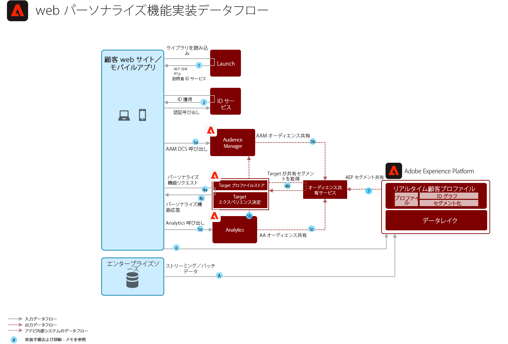

# オンライン／オフライン Web／モバイルパーソナライズ機能ブループリント

Web パーソナライズ機能を電子メールおよびその他の既知および匿名のチャネルパーソナライズ機能と同期します。

## ユースケース

* ランディングページの最適化
* 行動およびオフラインプロファイルターゲット設定
* オフラインインサイト（トランザクション、ロイヤリティおよび CRM データなど）およびモデル化されたインサイトに加えて、以前の製品／コンテンツ表示、製品／コンテンツの親和性、環境属性、サードパーティオーディエンスデータおよび人口統計に基づいたパーソナライズ機能

## アプリケーション

* [!UICONTROL リアルタイム顧客データプラットフォーム]
* Adobe Target
* Adobe Audience Manager（オプション）：サードパーティオーディエンスデータ、Co-op ベースのデバイスグラフ、Adobe Analytics で Platform セグメントを表示する機能および Platform で Adobe Analytics セグメントを表示する機能を追加
* Adobe Analytics（オプション）：Adobe Analytics データからの履歴行動データおよび詳細なセグメント化に基づいてセグメントを作成する機能を追加

## アーキテクチャ

## ガードレール

[Web およびモバイルパーソナライズ機能ブループリントの概要ページのガードレールを参照してください。](overview.md)

## 実装パターン

Web／モバイルパーソナライズ機能ブループリントは、以下に説明する方法で実装できます。

1. [!UICONTROL Platform Web SDK] または [!UICONTROL Platform Mobile SDK] と[!UICONTROL エッジネットワーク]を使用。
1. 従来のアプリケーション固有 SDK（AppMeasurement.js など）を使用

### 1. Platform Web／Mobile SDK およびエッジアプローチ

[Experience PlatformWebおよびモバイルSDKのブループリントを参照してください。](../data-ingestion/websdk.md)

### 2. アプリケーション固有 SDK アプローチ

## 実装の前提条件

IDの前提条件

* Adobe Experience PlatformからAdobe Targetにオーディエンスを共有するには、ECIDをIDとして使用する必要があります。
* 代替IDと代替IDの両方がAudience Managerに収集されている限り、Audience Managerは代替IDをECIDに解決できるので、代替IDを使用してAudience Manager経由でAdobe TargetにExperience Platformオーディエンスを共有できます。 Audience ManagerとTargetは、ECID IDを介してオーディエンスメンバーシップを解決するので、Adobe Targetに対する最終的なオーディエンス共有をおこなうには、ECIDが引き続き必要です。

| アプリケーション／サービス | 必須ライブラリ | メモ |
|---|---|---|
| Adobe Target | [!UICONTROL Platform Web SDK]*、at.js 0.9.1 以降または mbox.js 61 以降 | mbox.js は今後開発されないため、at.js をお勧めします。 |
| Adobe Audience Manager（オプション） | [!UICONTROL Platform Web SDK]* または dil.js 5.0 以降 |  |
| Adobe Analytics（オプション） | [!UICONTROL Platform Web SDK]* または AppMeasurement.js 1.6.4 以降 | Adobe Analytics トラッキングには、地域データ収集（RDC）を使用する必要があります。 |
| Experience Cloud ID サービス | [!UICONTROL Platform Web SDK]* または VisitorAPI.js 2.0 以降 | （推奨）アプリケーション呼び出しの前に ID が設定されるように、Experience Platform Launch を使用して ID サービスをデプロイします |
| Experience Platform Mobile SDK（オプション） | 4.11 以降（iOS および Android™ 用） |  |
| Experience Platform Web SDK | 現在の Experience Platform SDK バージョンである 1.0 には、[Experience Cloud アプリケーションをまだサポートしていない様々なユースケースがあります](https://github.com/adobe/alloy/projects/5) |  |

## 実装手順

1. web またはモバイルアプリケーション用に [Adobe Target を実装](https://experienceleague.adobe.com/docs/target/using/implement-target/implementing-target.html?lang=ja)します
1. [Adobe Audience Manager を実装](https://experienceleague.adobe.com/docs/audience-manager/user-guide/implementation-integration-guides/implement-audience-manager.html?lang=ja)します（オプション）
1. [Adobe Analytics を実装](https://experienceleague.adobe.com/docs/analytics/implementation/home.html?lang=ja)します（オプション）
1. [Experience Platform および[!UICONTROL リアルタイム顧客プロファイル]を実装します](https://experienceleague.adobe.com/docs/platform-learn/getting-started-for-data-architects-and-data-engineers/overview.html?lang=ja)
1. [Experience Cloud ID サービス](https://experienceleague.adobe.com/docs/id-service/using/implementation/implementation-guides.html?lang=ja)または [Experience Platform Web SDK](https://experienceleague.adobe.com/docs/experience-platform/edge/home.html?lang=ja) を実装します
   >[!NOTE]
   >
   >アプリケーション間のオーディエンス共有を許可するためには、各アプリケーションは、Experience Cloud ID を使用し、同じ Experience Cloud 組織に属している必要があります。
1. [Experience Platform および Adobe Target 間のオーディエンス共有（共有オーディエンス）のプロビジョニングをリクエスト](https://www.adobe.com/go/audiences)します

## 関連ドキュメント

* [Audience Manager およびその他の Experience Cloud ソリューションを使用した Experience Platform セグメント共有](https://experienceleague.adobe.com/docs/audience-manager/user-guide/implementation-integration-guides/integration-experience-platform/aam-aep-audience-sharing.html?lang=ja)
* [Experience Platform セグメント化の概要](https://experienceleague.adobe.com/docs/experience-platform/segmentation/home.html?lang=ja)
* [ストリーミングセグメント化](https://experienceleague.adobe.com/docs/experience-platform/segmentation/api/streaming-segmentation.html?lang=ja)
* [Experience Platform セグメントビルダーの概要](https://experienceleague.adobe.com/docs/experience-platform/segmentation/ui/overview.html?lang=ja)
* [Audience Manager ソースコネクタ](https://experienceleague.adobe.com/docs/experience-platform/sources/connectors/adobe-applications/audience-manager.html?lang=ja)
* [Adobe Audience Manager を使用した Adobe Analytics セグメント共有](https://experienceleague.adobe.com/docs/analytics/components/segmentation/segmentation-workflow/seg-publish.html?lang=ja)
* [Experience Platform Web SDK ドキュメント](https://experienceleague.adobe.com/docs/experience-platform/edge/home.html)
* [Experience Cloud ID サービスドキュメント](https://experienceleague.adobe.com/docs/id-service/using/home.html?lang=ja)
* [Experience Platform Launch ドキュメント](https://experienceleague.adobe.com/docs/launch/using/home.html?lang=ja)

## 関連するブログ投稿

* [[!DNL Blueprint for Web Personalization using Adobe Experience Platform Real-Time Customer Profile]](https://medium.com/adobetech/blueprint-for-web-personalization-using-adobe-experience-platform-real-time-customer-profile-fef2ce7a4b2f)
* [[!DNL Build an Optimal Online Experience: Enrich Unified Profile with Query Service]](https://medium.com/adobetech/build-an-optimal-online-experience-enrich-unified-profile-with-query-service-8027c196ab33)
* [[!DNL Integrating Adobe Experience Platform Decisioning Engine with AEM Websites]](https://jaeness.medium.com/integrating-adobe-experience-platform-decisioning-engine-with-aem-websites-9c222acd12e2)
* [[!DNL Adobe Experience Platform’s Identity Service — How to Solve the Customer Identity Conundrum]](https://medium.com/adobetech/adobe-experience-platforms-identity-service-how-to-solve-the-customer-identity-conundrum-f95e22d16ea9)
* [[!DNL How Adobe Experience Platform Predictive Audiences improves Personalized Experiences]](https://medium.com/adobetech/how-adobe-experience-platform-predictive-audiences-improves-personalized-experiences-1f75a60cb7a3)
* [[!DNL Adobe Experience Platform Web SDK for Audience Management]](https://medium.com/adobetech/adobe-experience-platform-web-sdk-for-audience-management-751fa6d063bc)
* [[!DNL Implementing Adobe Experience Platform Real-Time Customer Profile through our “Customer Zero” Program]](https://medium.com/adobetech/implementing-adobe-experience-platform-real-time-customer-profile-through-our-customer-zero-32e7cd952896)
* [[!DNL How Adobe Experience Platform Can Help Customers Personalize Their Mobile Messaging in Real-Time with Journey Orchestration Service and a Mobile Messaging Vendor]](https://medium.com/adobetech/how-adobe-experience-platform-helped-a-client-personalize-their-mobile-messaging-in-real-time-with-7d634aefa098)
* [[!DNL Segmentation in Seconds: How Adobe Experience Platform Made Real-time Customer Profiles a Reality]](https://medium.com/adobetech/segmentation-in-seconds-how-adobe-experience-platform-made-real-time-customer-profiles-a-reality-a7a8552b0847)
* [[!DNL Build an Optimal Online Experience: Enrich Unified Profile with Query Service]](https://medium.com/adobetech/build-an-optimal-online-experience-enrich-unified-profile-with-query-service-8027c196ab33)
