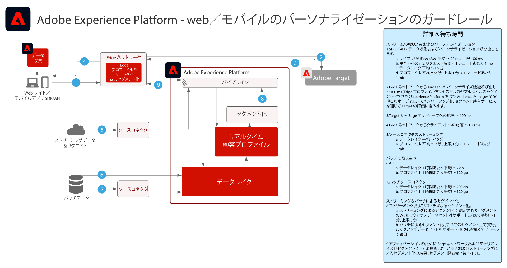

# Web およびモバイルパーソナライズ機能 ブループリント

Web およびモバイルパーソナライズ機能は、複数のアプリケーションでプロファイルおよびオーディエンスのセグメント化を使用する機能を処理して、カスタマーエクスペリエンスをパーソナライズおよび最適化します。顧客の行動、人口統計、ロイヤリティレベル、以前のトランザクションを活用して、レイアウト、コールトゥアクション、コンテンツをパーソナライズすることが可能です。

 

| ブループリント | 説明 | Experience Cloud アプリケーション |
|---|---|---|
| **[行動による Web／モバイルパーソナライズ機能](behavioral.md)** | <ul><li>オンライン行動およびオーディエンスデータに基づいてパーソナライズします。</li></ul> | <ul><li>Adobe Target</li><li>Adobe Real-time Customer Data Platform *（オプション）*</li><li>Adobe Analytics *（オプション）*</li><li>Adobe Audience Manager *（オプション）*</li></ul> |
| **[既知の顧客データ付き Web/モバイルパーソナライズ機能](known-personalization.md)** | <ul><li>完全な顧客プロファイルとセグメンテーションの強化により、パーソナライズされたエクスペリエンス実現します。</li><li>オフライン属性およびイベント（トランザクション、予約、CRM およびロイヤリティデータ）を使用してパーソナライズします。</li><li>Web、電子メール、その他の既知のチャネルをまたいでパーソナライズ機能を同期します。</li></ul> | <ul><li>Adobe Target</li><li>[!UICONTROL Real-time Customer Data Platform]</li><li>Adobe Analytics または Customer Journey Analytics *（オプション）*</li><li>Adobe Audience Manager *（オプション）*</li></ul> |

 

## Web およびモバイルパーソナライズ機能のガードレール

[オーディエンスとプロファイルのアクティベーションに関連するガードレールについては、プロファイルとセグメント化ガードレールのドキュメントを参照してください。](https://experienceleague.adobe.com/docs/experience-platform/profile/guardrails.html?lang=ja)

 

### 既知の顧客パーソナライゼーションガードレールの図

## 関連するブログ投稿

* [[!DNL Blueprint for Web Personalization using Adobe Experience Platform Real-Time Customer Profile]](https://medium.com/adobetech/blueprint-for-web-personalization-using-adobe-experience-platform-real-time-customer-profile-fef2ce7a4b2f)
* [[!DNL Integrating Adobe Experience Platform Decisioning Engine with AEM Websites]](https://jaeness.medium.com/integrating-adobe-experience-platform-decisioning-engine-with-aem-websites-9c222acd12e2)
* [[!DNL Content and Commerce AI: Personalizing Your Interactions with Customers Through Content Intelligence]](https://medium.com/adobetech/content-and-commerce-ai-personalizing-your-interactions-with-customers-through-content-intelligence-dc182601deab)
* [[!DNL Implementing Adobe Experience Platform Real-Time Customer Profile through our "Customer Zero" Program]](https://medium.com/adobetech/implementing-adobe-experience-platform-real-time-customer-profile-through-our-customer-zero-32e7cd952896)
* [[!DNL Segmentation in Seconds: How Adobe Experience Platform Made Real-time Customer Profiles a Reality]](https://medium.com/adobetech/segmentation-in-seconds-how-adobe-experience-platform-made-real-time-customer-profiles-a-reality-a7a8552b0847)
* [[!DNL Build an Optimal Online Experience: Enrich Unified Profile with Query Service]](https://medium.com/adobetech/build-an-optimal-online-experience-enrich-unified-profile-with-query-service-8027c196ab33)
